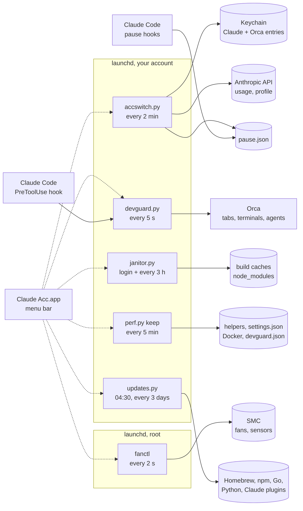

<div align="center">


# claude-acc

**A menu bar control room for a Mac that runs Claude Code agents all day.**

It rotates your Claude subscriptions before one hits the wall, keeps the agents' dev servers from eating your RAM, cleans up what they leave on disk, holds the Mac awake on a hotspot, and spins the fans up before the chip cooks.

[Install](#install) · [What it does](#what-it-does) · [How it works](#how-it-works) · [Numbers](#numbers) · [Command line](#command-line)

   

</div>

## Install

```sh
brew install outof-place/tap/claude-acc
claude-acc-setup          # scripts, launchd jobs and the menu bar app, into your account
claude-acc fans install   # optional: fan control, a small root helper (asks for Touch ID)
claude-acc hotspot on     # optional: Hotspot turbo, a small root helper (asks for Touch ID)
```

Or from source:

```sh
git clone https://github.com/outof-place/claude-acc.git
cd claude-acc
./install.sh              # builds the app and fanctl, then runs setup.sh
./install-fans.sh         # optional, root
./install-fsguard.sh      # optional, root: restarts a bloated fseventsd
```

Setup copies the scripts to `~/.local/share/claude-acc`, adds a `claude-acc` command to `~/.local/bin`, loads its launchd jobs (the account watcher, the janitor, the dev server guard, Ultra's keeper and the updater) and opens `~/Applications/Claude Acc.app`, which adds itself to your login items and puts itself back after every reinstall, unless you turn **Open at Login** off in the panel. It also adds its [limit hooks](#how-the-pause-works) to `~/.claude/settings.json`, next to your own hooks (the alarm for sessions that hit a limit, and the pause hooks when the optional pause is on), keeping a copy of the file from before the first change in `settings.json.bak-claude-acc`; run setup with `CLAUDE_ACC_NO_HOOKS=1` to leave them out. To stop agents from starting a second dev server of the same app, add the [Claude Code hook](#dev-server-guard).

After `brew upgrade claude-acc`, run `claude-acc-setup` again to put the new version in place. `claude-acc uninstall` removes the launchd jobs, the app, the command and the limit pause hooks and keeps your settings in `~/.local/share/claude-acc`; `claude-acc fans uninstall` gives the fans back to macOS first.

## What it does

| | |
| --- | --- |
| **Claude accounts** | Session and weekly usage of every subscription in the menu bar. Moves your running Claude Code sessions to the account with the most headroom once the active one is down to 5% of the session or 3% of the week, with no restart and no `/login`, skipping accounts whose subscription was canceled. When no account is left, it can [use up the last few percent of every account](#using-up-every-account) (`claude-acc drain on`), then tells you once; with the optional [limit pause](#how-the-pause-works) (`claude-acc pause on`) it also stops your sessions at a checkpoint instead of letting agents run into the wall, and wakes them when limits come back. Keeps [`depot claude`](#depot-sandboxes) sandboxes on another account than the laptop. Click any account for its plan, subscription start, renewal and both resets to the minute. |
| **Dev server guard** | Agents in [Orca](https://github.com/stablyai/orca) each run their own `next dev` with a preview tab, and Turbopack grows to 6-9 GB per server under their edits. The guard watches every dev server's real memory (the number macOS kills by), knows who is looking at it, restarts a bloated one in its own Orca terminal in seconds, stops duplicates, orphans and loops, and turns away an agent about to start a second server of the same app. |
| **Janitor** | Removes what a build or an install brings back (`.next`, `.turbo`, stale `node_modules`, Go and npm caches, Docker leftovers) when nobody is using it, at login and every 3 hours, and keeps folders that agents fill without end under a size cap. |
| **Stay Awake** | Like Amphetamine: awake until you say so or for 1-8 hours, optionally with the display on. Turns on by itself on any hotspot (iPhone over Wi-Fi or USB, Android, cellular) and keeps the hotspot from dozing off. With [Hotspot turbo](#hotspot-turbo) on, an iPhone hotspot stops queueing every session's requests behind one session's upload. |
| **Load & heat** | CPU load split into performance and efficiency cores, GPU load, and P-core, E-core, GPU, SSD and battery temperatures with a 20-minute chart. Fans on Auto, 50%, 75% or Max, going full speed whenever a chip passes 95 °C, and never fighting another fan app. |
| **Updates** | Everything on the Mac brought to its newest version every 3 days: Homebrew formulae and casks, global npm packages, Go programs, Python packages (rolled back if anything conflicts or stops importing), Python itself, Claude Code with its plugins and skills. Pins are respected and hand-edited skills are left alone. The panel shows when it last worked, what each part did and why something failed, and an Update button runs it now. |
| **Mail gateway** | Your agents read and answer the company mail without a password or key on disk: several mailboxes, Google Workspace through domain-wide delegation and any IMAP/SMTP server, behind one [MCP server](#mail-gateway) every Claude Code session gets. Each mailbox has its own level (read, modify, draft) and sending is off unless you allow it, so an agent leaves a draft for you. What an email says is treated as untrusted data, and every call lands in an audit log. |
| **Browser gateway** | Your agents use your own Chrome or Brave, with your logins, in tabs that never take focus: hidden tabs with no window or tab strip entry, one connection the browser approves once per start, shared by every Claude Code session through one [MCP server](#browser-gateway). The tools are Anthropic's browser use toolset, the one Claude models are trained on (`navigate`, `read_page`, `find`, `left_click`, `type`...), and the same toolset drives your browser from the Python and TypeScript SDKs. Agents see only their own tabs, hand a tab to you when a login, captcha or payment needs a human, and in the default guarded mode can't open browser settings, keep banks read-only and ask before running JavaScript or uploading a file. |
| **API credits** | Max plans come with monthly API credits ($200 on Max 20x, $100 on Max 5x), one Console organization per plan, and they expire every billing cycle. [`claude-acc credits`](#api-credits) keeps the keys of all those organizations in the Keychain as one pool and runs your scripts and `claude -p` jobs on the credit that expires first, so less of it goes to waste. The panel shows what is left in total and what expires next. |
| **Ultra** | One switch that tunes the Mac for agent work. Helpers no agent waits on move to the efficiency cores, memory hooks stop holding up every tool call, Node starts warm for everything sessions spawn, and the guard frees dev server memory sooner. Each change is measured before and after, and Off puts back exactly what was there. |


The UI is in English; the scripts' messages and the code comments are in Polish.

## How it works



- Every piece runs without the app. Each job writes its state to `~/.local/share/claude-acc`, and the app (dotted lines) only reads those files, calls the scripts and writes the fan mode. CPU and GPU load it reads from the kernel itself. Close it and the switching, cleanup, guard and fans keep working.
- The scripts are standard library only and still run on Python 3.9. Setup links uv's CPython 3.14 as `~/.local/share/claude-acc/python` when [uv](https://docs.astral.sh/uv/) is installed (it starts in 26 ms where the command line tools' 3.9 takes 37), the system `/usr/bin/python3` otherwise. Everything starts its script through `acc.py`, which runs it from cached bytecode: Python compiles the file it is given on every start, which was a third of a short run. Kernel numbers come through `ctypes`: `proc_pid_rusage` for memory, `sysctl` for swap and pressure, `KERN_PROCARGS2` for exact command lines.
- The app is Swift 6 with main-actor default isolation (SE-0466) and `@concurrent` for process work, Swift Charts for the charts, and SF Rounded throughout. It stays near idle with the panel open (1-2% CPU, from 40%): a state file that didn't change costs one `stat` and wakes no view, live readings (load, heat, fans, memory, build progress) change in place, since while any animation runs SwiftUI updates the whole panel on every frame, and the spinning fan is a Core Animation layer the render server turns.
- `fanctl` talks to the SMC through IOKit's `AppleSMC` user client. Reading needs no root; the daemon that writes runs as root, reads only a mode from your folder, and writes its readings back atomically.

### Accounts under the hood

A Claude Code account is the `claudeAiOauth` object inside a Keychain entry. Claude Code reads `Claude Code-credentials`, plus `Claude Code-credentials-<first 8 hex chars of sha256(config dir)>` when `CLAUDE_CONFIG_DIR` is set. [Orca](https://github.com/stablyai/orca) keeps a copy of every account you add to it under `Orca Claude Code Managed Credentials`. Switching accounts means copying one account's `claudeAiOauth` into the entries the live sessions read.

- `accswitch.py` holds all the logic. launchd runs `accswitch.py tick` every 2 minutes, with or without the app.
- Usage comes from `GET https://api.anthropic.com/api/oauth/usage`, and the account behind a token from `/api/oauth/profile`.

## Numbers

Measured on a MacBook Pro 16" M4 Max with 48 GB, on 2026-10-04, with several agents working in Orca.


A Turbopack dev server grows fivefold under an agent's edits, and `turbopackMemoryEviction: "full"` changes nothing: 6.01 GB against 5.97 GB after 30 edits. Next.js restarts a dev server only when its V8 heap fills, and Turbopack's memory lives outside it. What does work is a restart: the server comes back from its disk cache in seconds at a third of the size, which is what the guard does once a server passes 5 GB and goes quiet.


With agents compiling, macOS on Auto kept the fans at about 2,000 rpm and let the hottest CPU sensor reach **115&nbsp;°C**. The fixed settings, as the SMC reports them on the same Mac:

| Setting | Fan speed |
| --- | --- |
| macOS Auto, idle | ~1,400 rpm |
| 50% | ~3,560 rpm |
| 75% | ~4,670 rpm |
| Max | 5,777 rpm |

On any fixed setting the daemon goes to full speed when a sensor passes 95 °C and comes back below 85 °C.

Ultra, measured on the same Mac with Orca and nine Claude Code sessions running:

| Tweak | Before | After |
| --- | --- | --- |
| A memory helper that scanned its 1.9 GB database all day, moved to the efficiency cores | 32% of a P-core, ~1 W | 0.1%, ~0.1 W |
| Node compile cache for what sessions spawn: `require('typescript')` | 96 ms | 49 ms |
| `git status` in an agent worktree repo, with `untrackedCache` and `fsmonitor` (opt-in) | 71 ms | 26 ms |
| Hook wait on every agent tool call, with a synchronous memory hook made async | 53 ms p50, 73 ms p90 | 24 ms p50, 30 ms p90 |
| Orca's status hook, which every tool call waited for, made async | 36-39 ms p50 per call | 0 |
| The guard's hook before every Bash command, native instead of Python | 25-57 ms | 5-8 ms |
| rtk's hook before every Bash command, `rtk hook claude` instead of its shell script | 57-80 ms | 12-14 ms |

## How it avoids logging you out

Each of these rules comes from an account that actually lost its login while the tool was being built:

- Refreshing a token rotates it, and presenting a refresh token that was already used got the whole account logged out. Claude Code sessions refresh the active account on their own, about 5 minutes before the token expires, so the watcher never refreshes the active account while a session could. It copies the pair the session wrote instead, from whichever Keychain entry the sessions use (`Claude Code-credentials` without `CLAUDE_CONFIG_DIR`, the hashed one with it). It refreshes the active account itself only once the token has been expired for 15 minutes, when no session is running.
- An inactive account whose token no session holds is refreshed by whichever process reads it first (the watcher, a click, or the panel), one process at a time behind a file lock. The panel never refreshes a token that a session in any config directory may hold.
- It never writes a token it hasn't checked against the API first. A future expiry date doesn't prove the token still works.
- It replaces only `claudeAiOauth`. The same Keychain entry holds `mcpOAuth`, the tokens of your MCP servers, which belong to the config directory and survive every switch.
- A 429 from the usage endpoint means "unknown", never "dead". It backs off for 2 minutes, then 4, 8 and 15 while the endpoint keeps refusing, starts over after the first good answer, and doesn't refresh or flag anything in the meantime. Claude Code and Orca poll the same endpoint too, so it can throttle even while this tool is quiet. Whether a token works is checked against the profile endpoint, so switching still works while the usage endpoint is throttled. Accounts with a canceled subscription get a 403 there, so they aren't asked at all.
- Before overwriting the live entry it copies the token there back to its Orca copy, because the running session may have rotated it since the last switch.

## Using up every account

An account normally leaves the rotation at the switch threshold (`hard_session_left` / `hard_weekly_left`) and comes back once it has `min_session_left` / `min_weekly_left` again, so a few percent of each account go unused. With **Use up every account** in the panel's Claude Code card, or `claude-acc drain on`, the watcher spends them once no account has headroom:

- The active account keeps working to its last percent instead of being given up at the switch threshold.
- Once it is empty, the watcher switches to the account with the most left in its weaker window (at least 1% of both the 5-hour window and the week), then to the next one, and so on. Accounts in `last_resort` come last, `never` accounts are never used. Sessions that hit the wall in between wake on the switch through the `StopFailure` alarm.
- An account with real headroom (after a reset) takes over from the scraps as soon as it shows up, like any switch.
- One notification when this starts; the switches go to the switch log. When nothing is left anywhere, the usual warning or the limit pause follows. A pause running when the mode starts is lifted, because there is still something to work with.

Depot sandboxes only ever get accounts with real headroom, so they never land on a scrap. The mode is off by default.

## How the pause works

The pause is optional and off by default. **Pause at the limit** in the panel's Claude Code card switches it, and so do `claude-acc pause on` and `claude-acc pause off`: both write `limit_pause` to `config.json` and update the hooks in `settings.json` right away, and turning it off during a pause wakes the paused sessions. Open sessions keep the hooks they started with; new and resumed ones pick up the change. Without the pause, sessions keep working until the limit, Claude Code resumes them after the reset, the `StopFailure` alarm below wakes them earlier when the watcher switches to an account with headroom, and the watcher sends one notification per episode when no account has headroom.

Claude Code already waits at a usage limit and continues on its own after the reset (`Continue automatically at usage limit` in `/config`, on by default). What it lacks is a warning early enough for subagents to stop cleanly, any warning before the weekly limit, and a way to know that capacity came back on another account. Agents that hit the wall stop halfway through an edit and have to be started over. The pause fills those gaps with Claude Code hooks, which setup adds to `~/.claude/settings.json` (or `$CLAUDE_CONFIG_DIR/settings.json`) next to your own hooks.

- The watcher writes `~/.local/share/claude-acc/pause.json` when the active account is down to its switch threshold and no other account qualifies. It removes the file once the active account or another one is back at `min_session_left` and `min_weekly_left` (15% and 8%), not just above the switch threshold, so sessions don't wake up for one minute of work. A switch to an account with headroom ends it too. A throttled usage read leaves the pause as it is. With an account selected in Orca, or Claude Code signed in to an account outside Orca, there is no pause, because the watcher isn't in charge then.
- `hook.py` only reads that file. Outside a pause each hook costs two file checks and never starts Python. Setup writes them in exec form (`args`), which Claude Code starts without a shell, as `claude-acc-pause <mode>`: a few lines of C that answer in 3.1 ms, where `claude-acc-hook pause` (Swift, 5.0 ms, used when the C program is missing) loads its runtime first and the shell guard takes 7.6 ms. Without either program, the hooks are a short shell command with the same checks.
- `PostToolUse` delivers the checkpoint once per session and once per subagent: finish the current small step, write the state to `TASKS.md`, start nothing new, end the turn. Subagents return with a report of where they stopped. `PreToolUse` on `Agent` refuses new subagents. A message you type in a paused session lifts the pause for that session; subagent reports and Claude Code's own resume messages don't count.
- `Stop` starts a background alarm (`asyncRewake`) in sessions that were told to stop. It checks the file every 20 seconds, exits quietly if the session got going some other way, and wakes the session with an instruction to resume from `TASKS.md` and continue its subagents through `SendMessage` instead of starting them over. `StopFailure` with `rate_limit` starts the same alarm for a session that hit the wall: Claude Code resumes it by itself after that account's reset, and the alarm wakes it earlier if the watcher switches to an account with headroom. Both alarms carry a `timeout` of eight days and a minute: Claude Code cancels an `asyncRewake` hook at its timeout, 600 seconds when unset, so without it no session woke from a pause longer than ten minutes.
- `claude-acc resume`, or **Resume Now** in the panel, lifts the pause by hand. It stays lifted until limits recover and run out again.
- Ultra's `claude-hooks-async` never makes these hooks async: in the background their instructions would never reach the session.
- Setup keeps a copy of `settings.json` from before its first change in `settings.json.bak-claude-acc`. `CLAUDE_ACC_NO_HOOKS=1` leaves the hooks out (and removes the ones an earlier setup added), and `claude-acc uninstall` removes them.

To try the pause in one real session without pausing the others, start that session with its own pause file, `CLAUDE_ACC_PAUSE_FILE=/tmp/pause.json claude`, then create the file with `echo '{"episode": "1"}' > /tmp/pause.json` and delete it to end the pause. `CLAUDE_ACC_HOOK_LOG=/tmp/hook.log` logs every hook call.

## Requirements

- macOS 26 or newer on Apple silicon, with Swift 6.2 or newer (Xcode or the command line tools) to build the app. Homebrew builds it for you.
- `/usr/bin/python3` (ships with the command line tools). With [uv](https://docs.astral.sh/uv/) installed, setup uses its CPython 3.14 instead.
- Claude Code. Tested with 2.1.284.
- Orca with your Claude accounts added as managed accounts, and **System default** selected as the active Claude account in Orca. With a managed account selected, Orca puts its own account back whenever a terminal starts and every 15 minutes, undoing every switch, and it refreshes that account's token itself. claude-acc reads Orca's settings, and while an account is selected there the watcher stands down, switching is blocked and the panel tells you to pick System default.

## Command line

| Command | What it does |
| --- | --- |
| `claude-acc status` | Usage of every account and the switching order |
| `claude-acc who` | The active account, its burn rate and when it will hit the wall |
| `claude-acc switch <email>` | Switch to that account |
| `claude-acc switch --auto` | Switch to the next account in line |
| `claude-acc login <email>` | Log the account in again in the browser |
| `claude-acc heal [--deep]` | Recover accounts whose Orca copy died after a rotation elsewhere |
| `claude-acc tick` | One watcher pass (what launchd runs) |
| `claude-acc resume` | Lift the limit pause until limits recover (the panel's Resume Now) |
| `claude-acc pause [on\|off]` | Show, turn on or turn off the optional limit pause |
| `claude-acc drain [on\|off]` | Show, turn on or turn off using up every account |
| `claude-acc depot [--force]` | Which account the Depot sandboxes run on; `--force` sends its token again |
| `claude-acc depot --fallback` | Store a long-lived `claude setup-token` token for when no account has headroom |
| `claude-acc clean [--dry-run]` | Clean up now: every janitor task, whatever its schedule |
| `claude-acc mac status` | Free space, the last cleanup and warnings |
| `claude-acc update` | Update everything now: Homebrew, npm, Go, Python, Claude Code (the panel's Update) |
| `claude-acc updates [status\|run --dry-run]` | The last update run per package manager, or what a run would update |
| `claude-acc mac report` | What slows the Mac down: top processes, Spotlight, orphaned dev servers, data of uninstalled apps, broken launchd entries |
| `claude-acc mac spotlight` | Projects whose `node_modules` Spotlight indexes, and the settings pane to exclude them |
| `claude-acc mac optimize [--dry-run\|--undo]` | Faster Dock, window and Finder animations, and disabling launch agents whose app is gone. Reversible |
| `claude-acc guard status [--json]` | Dev servers, their memory, who watches them and what the guard is about to do |
| `claude-acc guard once [--dry-run]` | One guard pass, at most one action |
| `claude-acc guard stop <pid\|:port>` | Stop a dev server the way the guard does |
| `claude-acc guard recycle <pid\|:port>` | Restart a dev server in its own Orca terminal |
| `claude-acc guard pin <:port\|dir> [--for 12h \| --forever] [--reason TEXT] [--no-restart]` | An exception for a while: the guard never stops that server |
| `claude-acc guard unpin <:port\|dir\|all>` / `claude-acc guard pins` | Drop a pin / list pins with their reasons and expiry |
| `claude-acc fans [read\|keys]` | Fan speeds, CPU and GPU temperature, or every SMC key |
| `claude-acc fans set auto\|<30-100>` | Set the fans by hand (root) |
| `claude-acc fans install\|uninstall` | Install the fan daemon, or remove it and give the fans back to macOS |
| `claude-acc hotspot on\|off` | Hotspot turbo on or off (the first `on` installs the root helper) |
| `claude-acc hotspot status [--json]` | Whether it shapes now, the upload cap, and the queue delay it sees |
| `claude-acc hotspot install\|uninstall` | Install the hotspot daemon, or remove it and lift the cap |
| `claude-acc perf ultra on\|off\|status` | Turn Ultra on or off, or show what it changed and the numbers |
| `claude-acc perf bench network\|cpu\|gpu\|fs` | Measure: queueing in the network vs inside the connection, P-core share and wake-up latency, GPU time per app, the file cache |
| `claude-acc perf list` / `apply` / `undo <name>` | Every tweak on its own, with what it changes and how it was measured |
| `claude-acc perf-root vnodes trial [--keep]` | Root: a bigger vnode cache, measured before and after; `vnodes apply --persist` keeps it across reboots |
| `claude-acc perf-root spotlight apps-only\|undo` | Root: Spotlight indexes apps only; undo restores the previous privacy list |
| `claude-acc perf-root devtools add\|undo\|status` | Opens Developer Tools in System Settings and waits until Orca is on the list, so fresh Go test binaries skip Gatekeeper |
| `claude-acc perf bench agents` | Tool turnaround and hook waits from the last day of Claude Code transcripts, with the hooks that cost the most |
| `claude-acc perf bench gatekeeper` | How long the first run of a freshly built binary waits for Gatekeeper from this terminal |
| `claude-acc mail add <address> gmail\|imap [read\|modify\|draft] [--send] [...]` | Add a mailbox; for IMAP the password goes into the Keychain, `--token-command` gives a Gmail mailbox without delegation |
| `claude-acc mail google --service-account SA [--aws-audience A --aws-profile P]` | The Google service account and the identity that signs for it |
| `claude-acc mail doctor` | Check the identity and every mailbox |
| `claude-acc mail install` / `uninstall` | Register the `mail` MCP server, the `mail` skill and the prompt hint for every Claude Code session |
| `claude-acc mail wait <mailbox> '<query>' [--timeout 6h]` | Wait for a new matching message; agents run it in the background and get woken when it arrives |
| `claude-acc mail search\|read\|thread\|attachment\|modify\|draft\|send ...` | The same tools from the shell |
| `claude-acc browser install` / `uninstall` | Register the `browser` MCP server, the `browser` skill and the prompt hint for every Claude Code session |
| `claude-acc browser doctor` / `status [--json]` | What to click in Chrome and Brave, which one is connected, agent tabs |
| `claude-acc browser setup chrome\|brave` | Open the browser's remote debugging page in a new tab of that browser, where you tick the checkbox once |
| `claude-acc browser use chrome\|brave` / `tabs-mode hidden\|background` / `site <domain> act\|read\|deny\|-` / `mode guarded\|full` | The default browser, where agent tabs live, per-site levels, and whether agents ask before risky calls |
| `claude-acc browser disconnect` | Close the agents' tabs and the connection (the panel's Disconnect) |
| `claude-acc browser <member> ['<json input>']` | Any toolset member from the shell, such as `navigate '{"url": "example.com"}'` or `read_page '{"filter": "interactive"}'`; calls from one agent session share its tabs |
| `claude-acc browser run "<task>" [--model M] [--browser chrome\|brave]` | One task in the SDK tool runner on the native toolset, in your browser (default model `claude-opus-5-5`) |
| `claude-acc browser api-key` | Store the Anthropic API key for `run` in the Keychain |
| `claude-acc credits status [--json]` | API credits left per Console organization and in total, with the next cycle reset |
| `claude-acc credits add <email> --scope own\|<client> [--org ID]` | Register the organization linked to that plan; the API key goes from a hidden dialog straight to the Keychain |
| `claude-acc credits pending <email>` / `remove <email>` | Mark a plan whose API credits button hasn't appeared yet / forget an account and its key |
| `claude-acc credits balance <email> --remaining-usd N [--expires-at DATE]` | Record what Console shows under Promotional credits |
| `claude-acc credits exec --purpose NAME [--scope] [--org ID] [--no-env] -- <cmd>` | Run a command on the credit that expires first; 75 when none has headroom, 76 when it ran out mid-run |
| `claude-acc credits helper --purpose NAME` | `apiKeyHelper` for Claude Code and the Agent SDK under `exec --no-env` |
| `claude-acc credits record --org ID --usd N --purpose NAME` | Report what a call cost, so the balance stays current between Console readings |
| `claude-acc credits key --purpose NAME --json` | Which Keychain entry to use, without the key |
| `claude-acc uninstall` | Remove the launchd jobs, the app, this command and the limit pause hooks; settings stay |

## Configuration

`~/.local/share/claude-acc/config.json`. Every key is optional.

| Key | Default | Meaning |
| --- | --- | --- |
| `hard_session_left` | `5` | Switch when the active account has this % of the 5-hour window left |
| `hard_weekly_left` | `3` | Switch when it has this % of the week left |
| `min_session_left` / `min_weekly_left` | `15` / `8` | An account needs at least this much to be switched to, and the limit pause ends once an account has it again |
| `limit_pause` | `false` | [Pause sessions at a checkpoint](#how-the-pause-works) when no account has headroom; **Pause at the limit** in the panel and `claude-acc pause on\|off` set it and update the hooks |
| `drain` | `false` | [Use up the last few percent of every account](#using-up-every-account) once none has headroom; **Use up every account** in the panel and `claude-acc drain on\|off` set it |
| `last_resort` | `[]` | Emails used only when nothing else has headroom |
| `never` | `[]` | Emails never switched to |
| `config_dir` | `~/.claude` | The config directory whose sessions get switched |
| `other_config_dirs` | `[]` | Other config directories whose entries get the new token when an account refreshes, but are never switched |
| `depot_sync` | `true` | Keep the `CLAUDE_CODE_OAUTH_TOKEN` secret of `depot claude` sandboxes on an account with headroom |
| `depot_min_valid_hours` | `4` | A token sent to Depot must stay valid at least this long; a shorter one is refreshed first |
| `depot_bin` | `""` | Path of the Depot CLI; empty means `PATH`, then Homebrew |

## Depot sandboxes

[`depot claude`](https://depot.dev/docs/agents/claude-code/quickstart) starts Claude Code in a remote sandbox with the token stored in the organization secret `CLAUDE_CODE_OAUTH_TOKEN`. Every tick keeps that secret on the account first in the switching order **other than the local one**, so the laptop and the sandboxes never burn the same account. The token is sent again only when that account runs out of headroom, becomes the local account, or has less than `depot_min_valid_hours` of validity left; an idle account's token is refreshed before it is sent, the active account's never (its sessions own that refresh). With no other account left, the long-lived token from `claude-acc depot --fallback` goes out instead. A Depot failure is logged and never stops the switching. Requires the Depot CLI logged in to the organization (`depot login`).

## Mac janitor

Agents build, install and test all day, and every run leaves something on disk: `.next` caches of a few GB per worktree, `node_modules` of projects nobody touched in a month, `go-build` temp dirs from interrupted test runs, npx and uv caches. `janitor.py` removes what a build or an install brings back, and only what nobody is using.

launchd runs `janitor.py sweep` at login and every 3 hours as a background process: macOS keeps it on the efficiency cores and throttles its disk access, so a cleanup never competes with your work. Right after boot it waits until the system has been up for 5 minutes, and on battery below 30% it waits for the charger.

Before removing anything it checks, with one `lsof` over your processes, that no process has a file open in it and that no program has its working directory there. A terminal sitting at a prompt in the project doesn't count, a dev server does. The directory is renamed first and deleted after, so a dev server starting at that moment builds from scratch instead of reading half-deleted chunks. An interrupted delete is finished on the next run.

| Task | What goes | When |
| --- | --- | --- |
| `next` | `.next` and `.next-*` next to a `package.json`, unchanged for 24 hours | every run |
| `caches` | `.turbo`, `node_modules/.cache`, `node_modules/.vite`, unchanged for 7 days | daily |
| `node_modules` | every `node_modules` of a project where no file changed and git didn't move for 30 days | daily |
| `tmp` | `go-build*` in `$TMPDIR` older than 6 hours | every run |
| `caps` | the oldest entries of folders listed in `caps` once a folder is over its limit (the guard also runs it every 10 minutes) | every run |
| `go` | the least recently used entries of the Go build cache once it's over 20 GB, down to 12 GB, so agents keep their warm builds (Go trims entries unused for 5 days on its own) | daily |
| `npm` | `npm cache verify`, npx packages unused for 30 days (not the ones a running process uses, like MCP servers), npm logs older than a week | daily |
| `pnpm` | `pnpm store prune`, and after every run that removed a `node_modules` | weekly |
| `docker` | dangling images and build cache older than a week, only when the engine is already running | daily |
| `xcode` | DerivedData unchanged for 14 days, unavailable simulators | daily |
| `brew` | `brew cleanup --prune=14` | weekly |
| `uv` | `uv cache prune` | weekly |
| `logs` | files in `~/Library/Logs` older than 30 days | daily |

Each run also checks which projects' `node_modules` end up in the Spotlight index. Spotlight skips directories whose name starts with a dot or ends with `.noindex`, so pnpm's `.pnpm` store is never indexed, but hoisted `node_modules` (Expo, npm, yarn) are, and every install makes Spotlight chew through tens of thousands of files. Neither a `.metadata_never_index` file nor `chflags hidden` stops it on current macOS. The fix is System Settings > Spotlight > Search Privacy; `claude-acc mac spotlight` lists the projects and opens that pane.

`janitor-root.sh` does what needs root, run it by hand with `sudo`: it parks system launchd entries whose app is gone in `/Library/launchd-disabled-<date>` and removes crash reports older than a month. With `--high-power` it also switches a Mac that supports it to High Power mode on the charger (battery stays on automatic). `--dry-run` shows what it would do. The iOS simulator dyld cache in `/Library/Developer/CoreSimulator/Caches` is protected by SIP even from root, so it stays.

Configuration lives in `~/.local/share/claude-acc/janitor.json`. Every key is optional.

| Key | Default | Meaning |
| --- | --- | --- |
| `roots` | `~/Documents`, `~/Developer`, `~/Projects`, `~/code`, `~/src` | Where projects live |
| `protect` | `[]` | Paths the janitor never touches (footage, experiment results) |
| `next_idle_hours` | `24` | Age of a `.next` cache before it goes |
| `cache_idle_days` | `7` | Age of `.turbo` and `node_modules/.cache` |
| `node_modules_idle_days` | `30` | Project inactivity before its `node_modules` goes, `0` turns it off |
| `npx_idle_days` | `30` | Age of an npx package |
| `go_cache_max_gb` / `go_cache_keep_percent` | `20` / `60` | Go build cache size that triggers a trim, and how much of it the trim keeps (the most recently used entries) |
| `derived_data_idle_days` | `14` | Age of Xcode DerivedData |
| `log_days` | `30` | Age of logs in `~/Library/Logs` |
| `min_battery_percent` | `30` | On battery below this, the run waits for the charger |
| `notify_min_gb` | `2` | A run that frees at least this much sends a notification |
| `low_disk_gb` | `40` | Below this much free space, a warning (at most every 12 hours) |
| `skip` | `[]` | Task names to leave out, like `["docker", "brew"]` |
| `caps` | `[]` | Folders agents fill without end, like `[{"path": "~/.cache/portivo-perf/*/builds", "max_gb": 10, "keep": 1}]`. Entries over `max_gb` go oldest first (by creation date, since `rsync -a` copies mtimes); the `keep` newest always stay, and so does anything changed in the last `fresh_minutes` (10) |

## Dev server guard

With a few worktrees open in Orca, every agent starts its own `next dev` and opens a preview tab. Measured on a 48 GB Mac on 2026-10-04:

- a Turbopack dev server holds its module graph in native Rust memory and reaches 7-8 GB of footprint after an hour of agent edits. A restarted one was back from 2.3 to 7.8 GB within 10 minutes. Next.js has its own restart watchdog, but it only watches the V8 heap, and Turbopack's `turbopackMemoryEviction: 'auto'` waits for memory pressure feedback from the OS;
- the OS never gives it. With 12.7 of 13.3 GB of swap used, `kern.memorystatus_vm_pressure_level` still said normal, right until jetsam started killing processes with reason `low-swap`;
- an open preview keeps an HMR websocket, so every file an agent saves is a recompile and a page reload: one `tokens.css` edit cost the server with a preview 10 s of CPU, the six servers without one 0.1 s.

`devguard.py` runs from launchd all the time (`KeepAlive`, standard priority, so it gets the CPU exactly when the Mac is choking) and looks every 5 seconds without starting a single process: the process table from `sysctl` (`KERN_PROC_ALL`, `KERN_PROCARGS2`), sockets from `proc_pidfdinfo`, and Orca over its own unix socket. A pass used to spawn `ps`, `lsof` and four `orca` CLI calls, 3.9 s of CPU a minute in child processes; now it takes about 0.2 s. It reads:

- memory the way jetsam counts it: `phys_footprint` from `proc_pid_rusage`, plus CPU time and disk writes, read through `ctypes` without forking anything per process;
- who watches each server: TCP clients of its ports (an Orca tab, a browser, a headless Chrome), Orca's preview tabs, and whether the tab is the one you are looking at (active tab of the worktree selected in Orca);
- memory pressure from swap growth and the compressor's `vm.compressor.compactor.swapouts_queued_pressure` counter. Swap that stays full after memory was freed is only a warning; full and still growing is critical;
- Orca's worktrees, agents and terminals, so it knows which terminal a server runs in and whether an agent is working there. Reads go over Orca's runtime socket with the request its CLI sends, and fall back to the `orca` CLI when that fails; actions (restarting a server in its terminal) always use the CLI. It never starts Orca.

What it does, gentlest first:

| Action | When |
| --- | --- |
| background QoS (`PRIO_DARWIN_BG`, efficiency cores and throttled disk) | a server you are not looking at; back to normal priority once you switch to its preview |
| restart in its own Orca terminal | the server is over `max_server_gb` and has been quiet for `quiet_seconds`. Turbopack comes back from its disk cache in seconds and the preview reconnects by itself. The exact argv comes from `KERN_PROCARGS2` and goes back in with `orca terminal send`, only into a plain shell that is back at its prompt |
| stop | a second server of the same app nobody watches, a server whose agent or terminal is gone, a server nobody watched or used for `idle_minutes` (twice that while an agent works in its worktree), and a server restarted `max_recycles_per_hour` times within an hour, which is the HMR loop again |
| free the biggest | dev servers over `budget_percent` of RAM, or memory pressure. With a warning only servers without a preview or bloated ones; when critical, also ones agents watch. The server you watch is never stopped, at most restarted |

One action at a time, then `cooldown_seconds` to let memory settle, and the swap growth window starts over so an old trend can't trigger the next one. A server younger than `grace_minutes` is left alone. After a stop the guard closes the server's background preview tabs in Orca (they would only keep reloading), writes a `devguard: ...` comment on the worktree card when the card has no comment of someone else's, sends a notification, and logs the command to bring the server back.

### Pins: exceptions for a while

Some servers have to stay up even when nobody watches them: a server a film pipeline captures from every few minutes, a demo you are about to show. `protect` in the config is permanent; a pin is the same promise for a while, set from the terminal (by you or by an agent) without editing JSON:

```sh
claude-acc guard pin :3747 --for 24h --reason "hero film captures"
claude-acc guard pin ~/code/site/apps/web          # a directory: every server in or below it
claude-acc guard pins
claude-acc guard unpin :3747
```

A pinned server is never stopped: not as idle, a duplicate, an orphan, over budget or under pressure. When it bloats over `max_server_gb` it is still restarted in its terminal (it is back in seconds), and a restart loop only warns. `--no-restart` holds even that, until memory is critical: then the biggest pinned server is restarted, never stopped, and only when nothing unpinned is left to free. Pins last 12 hours unless you say `--for 90m`, `--for 2d` or `--forever`, live in `~/.local/share/claude-acc/devguard-pins.json`, take effect on the next pass without restarting the guard, and show up in `guard status` with their reason and expiry. Expired ones are ignored.

`claude-acc-hook` is a `PreToolUse` hook for Claude Code. When an agent is about to start a dev server (also through `orca terminal create --command`, `cd`, `pnpm -C`, `--filter`), it refuses a second server of an app that already runs and gives the agent its URL instead, and refuses a new one when memory is critical or the servers are over budget. It denies even under `--dangerously-skip-permissions`. `DEVGUARD_ALLOW=1` in front of the command lets it through. Add it to `~/.claude/settings.json`:

```json
{ "hooks": { "PreToolUse": [ { "matcher": "Bash", "hooks": [
  { "type": "command", "command": "$HOME/.local/share/claude-acc/claude-acc-hook", "timeout": 10 }
] } ] } }
```

The hook runs before every Bash command of every agent, and most commands neither start a dev server nor bring Go or JS work for the scheduler. `claude-acc-hook` is a small native binary that answers those in about 5 ms; a command where one of the words that matter stands as a whole word goes on to `devguard.py admit` with the same input, which decides everything. The words and the pattern come from `devguard.py words`, written to `hook-words.json` at setup. The scheduler knows a program by its whole token and a dev server start always follows whitespace, so `2>/dev/null`, `export`, `main_test.go` or `tsconfig.json` no longer start Python: on a day of real commands, 16% went to Python instead of 45%, and none of the commands Python acts on was lost. Before, Python started for every command: 44 ms each, and hundreds when the Mac is loaded. `python3 devguard.py admit` still works as the hook on its own.

Configuration lives in `~/.local/share/claude-acc/devguard.json`. Every key is optional.

| Key | Default | Meaning |
| --- | --- | --- |
| `mode` | `enforce` | `observe` only reports and logs |
| `budget_percent` | `35` | All dev servers together, as % of RAM |
| `max_server_gb` | `5` | A single server above this is bloated |
| `swap_warn_percent` / `swap_critical_percent` | `12` / `20` | Swap as % of RAM for a warning and, while it grows, for critical |
| `available_critical_percent` | `10` | `kern.memorystatus_level` at or below this is critical |
| `kernel_pressure` | `true` | Take the kernel's pressure level (`kern.memorystatus_vm_pressure_level`) into account; `false` relies on swap and `memorystatus_level` alone |
| `quiet_seconds` | `30` | No CPU and no terminal output for this long before a watched server is restarted (10 times that for the one you watch) |
| `grace_minutes` | `3` | A new server is left alone this long |
| `duplicate_minutes` / `orphan_minutes` / `idle_minutes` | `5` / `10` / `45` | When a duplicate, an orphan and an idle server go |
| `cooldown_seconds` | `45` | Pause after every action |
| `max_recycles_per_hour` | `2` | More restarts of one app than this is a loop: stop instead |
| `background_unattended` | `true` | Background QoS for servers you don't watch |
| `close_tabs` / `orca_comment` / `notify` | `true` | What happens around a stop |
| `protect` | `[]` | Server paths (or anything above them) and ports like `":3000"` the guard never touches; for a while, use `guard pin` |
| `scope` | `[]` | When set, the guard only sees servers under these paths |
| `runtimes` | `node`, `bun`, `deno` | Interpreters dev servers run under |
| `caps_minutes` | `10` | How often the guard applies the janitor's `caps`, `0` turns it off |

## fseventsd guard

`fseventsd` hands file events to every watcher on the Mac: Spotlight, git fsmonitor, dev servers, tsserver, editors. It normally takes 5 to 50 MB. On 2026-10-06 it grew to 41.7 GB on a 48 GB Mac, swap reached 48 GB, the system stopped answering and the kernel restarted it (`watchdog timeout: no checkins from watchdogd`). It had been growing for a day: 7.2 GB seven hours before the crash, then about 5 GB an hour. The memory guard for your own processes can't see it, because it runs as root.

`./install-fsguard.sh` installs `fsguard.py` as a root LaunchDaemon that runs every minute. When two readings in a row are over 4 GB, it stops `fseventsd` (SIGTERM, then SIGKILL after 10 seconds) and launchd starts it again at once. Watchers registered before the restart go deaf: a Node `fs.watch` gets nothing afterwards. So the guard then stops the `git fsmonitor--daemon` processes, and the next git command starts a fresh one with a full scan; the [dev server guard](#dev-server-guard) restarts, in their Orca terminal, the dev servers started before the restart, except protected ones; editors and language servers (tsserver, gopls) need a restart by hand, and a notification says so. That cost is why the limit sits at 4 GB, a hundred times the usual size and a tenth of the crash. Restarts are at least five minutes apart. The log at `/Library/Logs/claude-acc-fsguard.log` keeps the daemon's size every hour (every ten minutes above 512 MB) and notes any other process above 8 GB. `./install-fsguard.sh --uninstall` removes it.

## Updates

`updates.py` keeps the tools on the Mac at their newest version:

- **Homebrew**: `brew update`, then every outdated formula and cask. Casks that update themselves (Chrome, Slack) are left to their own updater, as `brew upgrade` does without `--greedy`. Pinned formulae (`brew pin`) stay where they are.
- **npm**: every global package to its latest version, major versions included (for global packages `npm outdated` reports `latest` as the wanted version). `npm_pins` keeps a package within one major version. npm 12 doesn't run the install scripts of packages outside `allowScripts`, so a package that downloads its binary in one installs fine and then doesn't run. Each command a package puts on the `PATH` is run with `--version` before and after its upgrade; one that stopped answering brings the old version back, and the panel names the blocked scripts with the `--allow-scripts` command to allow them on purpose.
- **Go**: every program `go install` put in `GOBIN` (or `GOPATH/bin`), read with `go version -m` and installed again at the module's latest version.
- **Python**: the pip packages of every Python people install into: the default `python3` from uv (`uv python install --default`), python.org and Homebrew. The packages share their dependencies, so they go up together: one `pip install -U --upgrade-strategy eager` over the packages nothing else requires, so the resolver sees every constraint at once, from wheels only (a package whose new release is source only, like `llama-cpp-python`, stays where it is). Packages in the user site get their own run with `--user`; packages installed from a folder or git are left alone, because the PyPI package of the same name is someone else's. `pip check` runs before and after, and so does an import of every package nothing else requires: a new conflict, or a package that stopped importing (a native library `pip check` can't see), puts that Python back to the versions it had. A package the resolver kept lower because another needs it is shown as held back, not failed. `pip_pins` keeps a package at a specifier, even when it is only a dependency of another. A new Playwright gets its browsers.
- **Python itself**: a newer patch release of the python.org Python is downloaded and its signature checked (Developer ID Installer: Python Software Foundation); it needs an admin password, so the panel offers an **Install** button that opens it. A new minor version (3.14 to 3.15) is never offered, since every package would need installing again. Pythons managed by `uv` go up with `uv python upgrade`, except one whose packages this step upgrades (uv's default `python3`): a new patch is a new folder, and the packages would stay behind in the old one.
- **Claude Code**: `claude update`, then the plugin marketplaces and every installed plugin in its own scope (user, project and local, each run from its project; installs whose project is gone are skipped). A plugin whose update wants to run a command from its marketplace is never confirmed by the script: the panel gives the command to review in Terminal. Skills installed with `npx skills add -g` are updated too, except one whose folder no longer matches the hash in `~/.agents/.skill-lock.json`: you edited it, and an update would overwrite it.

launchd starts `updates.py run` every day at 04:30 (a sleeping Mac catches up when it wakes), and the script goes ahead once 3 days have passed since the last run, or the next night after a run that failed. Each cask and npm package is upgraded on its own and every result is checked afterwards, so one failure doesn't stop the rest and the panel names it. A cask whose installer asks for an admin password can't be upgraded in the background, so the panel gives the command to run in Terminal. A notification comes for a new problem, not every night for the same one. The **Update** button and `claude-acc update` run it now; the full output of every command goes to `~/.local/share/claude-acc/updates.log`.

Configuration lives in `~/.local/share/claude-acc/updates.json`. Every key is optional.

| Key | Default | Meaning |
| --- | --- | --- |
| `every_days` | `3` | Days between runs |
| `retry_hours` | `20` | After a failed run, try again once this many hours have passed (the next night) |
| `skip` | `[]` | Steps to leave out: `brew`, `npm`, `go`, `pip`, `claude` |
| `npm_pins` | `{}` | Global npm packages held in a version range, e.g. `{"pnpm": "11"}` keeps pnpm on the newest 11.x |
| `pip_pins` | `{}` | Python packages held at a specifier, e.g. `{"fb-idb": "==1.1.7"}` |
| `python` | uv's default, python.org, Homebrew | The Python (a path or a list) whose packages are upgraded |

## Mail gateway

`claude-acc mail mcp` is a stdio [MCP](https://modelcontextprotocol.io) server (protocol 2026-07-28 without a handshake and 2025-11-25 with one, no SDK, Python standard library only) with eight tools: `mail_mailboxes`, `mail_search`, `mail_read`, `mail_thread`, `mail_attachment`, `mail_modify`, `mail_draft` and `mail_send`. `claude-acc mail install` registers it as `mail` in your user scope, so every session on the Mac has it, together with the `mail` skill and a prompt hint (below); scripts and other agents get the same tools from `claude-acc mail <tool>`. Configuration lives in `~/.local/share/claude-acc/mail.json` (0600).

**Mailboxes.** Each one has a provider, a level and a send switch:

```json
{
  "google": {
    "service_account": "claude-mail@your-project.iam.gserviceaccount.com",
    "identity": {"type": "aws", "audience": "//iam.googleapis.com/projects/N/locations/global/workloadIdentityPools/POOL/providers/PROVIDER", "aws_profile": "mail-gateway", "region": "eu-central-1"}
  },
  "mailboxes": {
    "contact@example.com": {"provider": "gmail", "access": "draft", "send": "ask"},
    "ceo@example.com": {"provider": "gmail", "access": "read"},
    "info@other.example": {"provider": "imap", "access": "modify", "host": "imap.other.example", "smtp_host": "smtp.other.example"}
  }
}
```

`read` searches and reads, `modify` also labels, archives and marks read, `draft` also writes drafts, which never need approval. `send` is `off` (the default: the agent leaves the draft and you send it), `ask` or `auto`. With `auto` the draft goes out at once: while no mailbox is `ask`, `mail_send` carries no approval flag, so a session in `bypassPermissions` sends without stopping. With `ask` a person approves every send: `mail_send` carries Claude Code's `anthropic/requiresUserInteraction` (the flag is per tool, so once any mailbox is `ask`, Claude Code prompts for every send), so Claude Code shows its permission prompt on every call, even in `bypassPermissions`, with the recipients and subject the agent must copy from the draft (the gateway refuses if they differ). Other clients get the gateway's own confirmation through MCP elicitation, or the agent has to ask you and pass `user_confirmed`. The **Mail** card in the panel shows every mailbox, whether it answers, its level and send mode, today's calls and the last few calls agents made; **Check** signs in to each one.

**Google Workspace.** A service account with [domain-wide delegation](https://support.google.com/a/answer/162106) for `gmail.readonly`, `gmail.modify` and `gmail.compose` acts as each mailbox. Nothing secret sits on disk:

- `identity.type: "key"` keeps the service account key only in the Keychain (service `claude-acc-mail`, account `google-service-account`). `claude-acc mail key-create --service-account SA` asks the IAM API for a key with your gcloud sign-in and puts the answer straight into the Keychain, and each delegation JWT is signed by `/usr/bin/openssl` reading the key from a pipe, so it never touches a file. It never expires and needs no sign-in, at the price of a long-lived secret; organizations that block key creation (`iam.disableServiceAccountKeyCreation`) need a one-off exception.

- `identity.type: "aws"` signs an STS `GetCallerIdentity` with your AWS credentials (`aws configure export-credentials`, any profile, typically a role you assume), Google STS exchanges it in a [Workload Identity pool](https://cloud.google.com/iam/docs/workload-identity-federation-with-other-clouds) for a federated token, and IAM Credentials `signJwt` signs the delegation JWT with `sub` set to the mailbox. No browser session, so no reauthentication every few hours.
- `identity.type: "gcloud"` uses your Application Default Credentials instead; your Google account needs `roles/iam.serviceAccountTokenCreator` on the service account.

Tokens stay in memory, one per mailbox and scope, and each call asks for the narrowest scope it needs.

**A Gmail mailbox without delegation.** When you are not the admin of the domain (an employer's or a client's Workspace, a personal Gmail), `--token-command` takes a command that prints an OAuth access token from the mailbox owner's own consent, for example one built on `gws`. Such a mailbox needs no service account. The gateway reads the token's scopes from Google's tokeninfo once per token and refuses an operation the consent does not cover, naming the missing scope, so a read-only consent fits the `read` level.

**IMAP and SMTP.** Any server over TLS. The password, or an app password, sits in the Keychain under the service `claude-acc-mail` (`claude-acc mail add` asks for it in a system dialog with a hidden field and stores it through `security`, so it never passes through the agent, a process list or your shell history); `--xoauth2-command` takes a command that prints an OAuth token instead, for Microsoft 365 and the like. Search takes the useful part of Gmail's syntax (`from: to: cc: subject: newer_than:7d after: before: is:unread is:starred in:FOLDER` and words) and turns it into IMAP `SEARCH`; threads are rebuilt from `Message-ID` and `References`; `UNREAD` and `STARRED` are flags, removing `INBOX` moves to the archive folder and `TRASH` to the trash; drafts are appended to the drafts folder, and a sent draft goes out over SMTP and lands in the sent folder. A connection waits two minutes for the next call and is checked with `NOOP` before reuse, so a run of calls signs in once; on a distant server the TLS handshake and `LOGIN` are most of a call. Folder names default to `INBOX`, `Archive`, `Trash`, `Drafts` and `Sent` and can be set per mailbox (`archive_folder`, `trash_folder`, `drafts_folder`, `sent_folder`).

**How agents find it.** `claude-acc mail install` puts three things in place, and `claude-acc-setup` refreshes them whenever mailboxes are configured:

- the `mail` skill (`~/.claude/skills/mail/SKILL.md`): a description of a few lines that Claude Code keeps in context, and a short recipe it loads only when a task needs an email (find, read, attachment, answer, send, file, wait);
- a prompt hint: a `UserPromptSubmit` hook (`hint.py`, shared with the browser gateway, about 10 ms, exec form) that gives the session one line with your mailboxes and their levels when your message talks about mail, a reply from someone, a verification code or one of the configured addresses, at most once per session;
- the guard: the dev server guard's Bash hook refuses commands that read the gateway's secrets out of the Keychain (`security find-generic-password ... claude-acc-mail`, `dump-keychain`), so the key and passwords stay with the gateway.

`claude-acc mail wait <mailbox> '<query>'` waits for a new message matching the query (messages that already matched when it started don't count). An agent runs it in the background and is woken by Claude Code when it exits: code 0 with the message, 3 after `--timeout`.

**Untrusted content.** An email is data from a stranger. The gateway strips control, zero-width and bidirectional characters, turns HTML into text without scripts and styles, cuts long bodies, lists links without opening them, and hands bodies to the agent inside `<untrusted-email id="...">` with a random id per call, so a message can't close the envelope early; a fake tag inside a message is removed. Attachments go to `~/.local/share/claude-acc/mail/attachments` with owner-only permissions. The server's instructions tell the agent never to act on what an email asks. Every call, successful or not, is appended to `~/.local/share/claude-acc/mail/audit.jsonl` with the client, tool, mailbox and ids, never the content.

## Browser gateway

`claude-acc browser mcp` is a stdio MCP server with Anthropic's browser use toolset (`browser_toolset_20260801`), the tools Claude models are trained on, under their own names and inputs: `navigate`, `screenshot`, `zoom`, `left_click`, `right_click`, `middle_click`, `double_click`, `triple_click`, `hover`, `left_click_drag`, `left_mouse_down`, `left_mouse_up`, `mouse_move`, `scroll`, `scroll_to`, `type`, `key`, `hold_key`, `wait`, `read_page`, `find`, `get_page_text`, `form_input`, `file_upload`, `read_console`, `read_network`, `javascript_exec`, `new_tab`, `list_tabs`, `switch_tab` and `close_tab`. Three more belong to the gateway: `show_tab`, `user_tabs` and `borrow_tab`. A target is a ref from `read_page` or `find` (`{"type": "ref", "ref": "ref_3"}`) or a point on the last screenshot (`{"type": "coordinate", "x": 640, "y": 300}`). Results read like the API's own: `Navigated to <url> - <title> (HTTP 200)`, page content in an envelope, and a Tab Context with the agent's tabs and what changed (tabs opened, downloads, dialogs, refused navigations) whenever that changed. `claude-acc browser install` registers it as `browser` in your user scope with the `browser` skill and the shared prompt hint; scripts call any member with `claude-acc browser <member> '<json>'`. Python standard library only: its own WebSocket client and the Chrome DevTools Protocol, no Puppeteer, no Node.

**From the SDKs.** `sdk/python/claude_acc_browser.py` (`ClaudeAccBrowser`, `AsyncClaudeAccBrowser`) and `sdk/typescript/claude-acc-browser.ts` (`ClaudeAccBrowser`) subclass the SDKs' abstract browser toolsets (`anthropic>=1.12`, `@anthropic-ai/sdk>=0.132`). Your own agent passes one to `tool_runner` / `toolRunner` and keeps the SDK's URL and file policies and confirmations, while every call runs in your browser through the same daemon, gate and audit log. `claude-acc browser run "<task>"` is that loop ready made: `uv run --with anthropic`, streaming, with each tool call started before the response ends, and the key from `ANTHROPIC_API_KEY` or the Keychain (`claude-acc browser api-key`).

**Getting in, once.** Since Chrome 136 a browser on its default profile ignores `--remote-debugging-port`. Since 144 the way in is a checkbox: tick *Allow remote debugging for this browser instance* at `chrome://inspect/#remote-debugging` (or `brave://inspect/...`). A link or `open` can't reach these pages, so `claude-acc browser setup` and the panel's **Turn on** open the page in a new tab of that browser through AppleScript. It survives restarts. The browser then listens on localhost only and asks *Allow remote debugging?* for every new connection, bringing its window forward. So the connection is held by one daemon (`claude-acc browser serve`, started by the first tool call, gone after ten quiet minutes) and every session talks to the daemon over a `0600` unix socket. You click **Allow** once per browser start, not once per session. While it is connected the browser shows its *controlled by automated test software* bar. After `idle_minutes` (20) without a call, or on **Disconnect** in the panel, the daemon closes the agents' tabs and the connection, so the bar goes away. While a running agent session still has tabs open, it waits six times as long (two hours by default), so an agent that stops for a build or a test run comes back to its pages.

**No focus taken.** Agent tabs are hidden targets by default (`tabs-mode hidden`): pages with your cookies and logins that have no window and no place in the tab strip. Focus emulation keeps them rendering at full rate, and they get a 1280x860 viewport for layout and screenshots. With `tabs-mode background` they open as background tabs in your last window instead. No tool brings a page forward, and `switch_tab` only changes which tab the agent works on. A page that opens a window (`target=_blank`, `window.open`) gets it as another agent tab, reported in the Tab Context. File choosers are intercepted, so no native dialog appears over your work. `show_tab` turns a hidden tab into a normal background tab and sends a notification, for the login, captcha, 2FA or payment only you should do. `borrow_tab` lets an agent borrow one of your own open tabs (listed by `user_tabs`), and `close_tab` gives it back without closing it.

**What agents see.** Not screenshots by default: `read_page` gives the page's accessibility tree in the toolset's format, `role "name" [ref_N] [flags]: value` indented by depth, with layout containers removed, text runs joined, table rows as cells, `<select>` options inline, and frames from other sites (a payment field, a captcha) included through their own sessions. Without a filter it shows what is in the viewport, `interactive` only what can be acted on, `all` the whole page. A ref stays the same for the same element until the page loads a new document. `find` matches a description ("search field", "Download invoice link") against roles and names, and `get_page_text` gives the text, up to 50 000 characters. Screenshots are JPEG at one CSS pixel per pixel, so coordinates are used as they are. Clicks and keys are real input events (`Input.dispatchMouseEvent`, `insertText`), `form_input` sets fields, selects and checkboxes, and uploads go straight into the file input. The daemon keeps each tab's console and network requests for `read_console` and `read_network`. Alerts are accepted and confirms dismissed (accepted in full mode), and both show up in the Tab Context.

**The gate.** Each session sees and touches only the tabs it opened. When it ends, its tabs close two minutes later, except ones handed to you. From the shell every call is its own process, so the session is the Claude Code session the command runs in (`CLAUDE_CODE_SESSION_ID`, and its tabs close when that session's process is gone), else the Orca terminal or the terminal window; `CLAUDE_ACC_BROWSER_OWNER` names one yourself. Two agents calling `claude-acc browser` at once never navigate, read or close each other's tabs. In the default `guarded` mode sites have levels in `~/.local/share/claude-acc/browser.json`. `act` (the default) allows everything, `read` allows opening, reading and screenshots, `deny` allows nothing, and the longest matching pattern wins:

```json
{"default": "brave", "tabs": "hidden", "idle_minutes": 20,
 "sites": {"dashboard.stripe.com": "read", "*.internal.example": "deny"}}
```

Polish banks, Revolut, Wise and PayPal are `read` out of the box, because a payment is one click. Browser pages (`chrome://`, `brave://`, extensions, `file:`, `data:`, `javascript:`) are closed. A navigation to a closed or denied address is stopped before the request leaves (`Fetch`), so the page stays where it was and the Tab Context reports the refusal. `javascript_exec`, `file_upload`, `show_tab` and `borrow_tab` ask you first (`anthropic/requiresUserInteraction`), and uploads refuse files from `~/.ssh`, `~/.aws`, the Keychains, browser profiles and claude-acc's own state. The gateway never calls the cookie methods. Page content reaches the agent inside `<untrusted-page id="...">` with a random id, and fake closing tags are stripped from it. Every call lands in `~/.local/share/claude-acc/browser/audit.jsonl` with the session, tool, tab and address without its query string. Typed text and scripts are never logged, only their length and, for a script, a short hash.

**Full mode.** `claude-acc browser mode full` is for when you let the agent do anything. Nothing asks, every address is `act` except the levels you set yourself with `site`, browser pages and `file:` open, uploads take any file, and confirms are accepted. Sessions still see only their own tabs and the audit log still records every call. `claude-acc browser mode guarded` goes back.

**How agents find it.** The `browser` skill (when to use it and the recipe: navigate, read before you look, act on refs, waiting and popups, the human, done). The shared prompt hint names your default browser when a message talks about a browser, clicking, signing in or a console, and tells the agent what to ask you when debugging is off. The guard's Bash hook refuses commands that read the Chrome or Brave `Safe Storage` key or the profile's `Cookies`, `Login Data` and `Web Data` files. The **Browser** card in the panel shows each browser (connected, asking for Allow, ready, not running, debugging off with **Turn on**), the agents' tabs and the last call, refreshed every 5 seconds while the panel is open.

## API credits

Every Max plan gets monthly [API credits](https://platform.claude.com/docs/en/about-claude/api-credits-for-subscribers): $200 on Max 20x, $100 on Max 5x. They land in one Claude Console organization you link from claude.ai, show up there as **Promotional credits**, and pay for the Messages API, Message Batches, the Agent SDK and `claude -p` run with that organization's API key. They don't pay for interactive Claude Code, even with a key. They expire at the end of each billing cycle and never touch your plan: once they run out, requests fail with *credit balance is too low* until the next cycle. With several plans you have several organizations and several keys, and `claude-acc credits` turns them into one pool.

**Setting up an account.** Each plan can be linked to exactly one organization, and only support can change it, so give each plan a new organization of its own.

1. In Console (platform.claude.com), create an organization, for example `oop-credits-work`.
2. On claude.ai, signed in with that plan: **Settings > Billing > API credits > Link organization**, pick the new organization and accept the terms. No card is needed. The button is being rolled out over a few days, so if it isn't there yet, run `claude-acc credits pending work@example.com` and try again tomorrow.
3. In Console, in the new organization: **Settings > API keys > Create key**, linked to yourself and scoped to the **Default** workspace. A key that isn't scoped to a workspace needs an `anthropic-workspace-id` header on every request, which `claude -p` and plain scripts don't send.
4. `claude-acc credits add work@example.com --scope own` opens a dialog with a hidden field. Paste the key there. It goes straight to the Keychain (service `claude-acc-credits`, account = the email), and claude-acc asks the API which organization it belongs to, so a key pasted into the wrong account is refused. `--scope acme` (any lowercase name) marks a plan whose credit may only pay for that client's work.

**Running on credits.** `claude-acc credits exec --purpose nightly-digest -- python3 digest.py` picks the organization whose credit expires first and still has `--min-remaining-usd` (5) left, puts its key in `ANTHROPIC_API_KEY` for that command only, and passes stdin, stdout, stderr and the exit code through. It drops `ANTHROPIC_AUTH_TOKEN`, `ANTHROPIC_BASE_URL` and the Bedrock, Vertex and Foundry switches from the command's environment, because Claude Code would prefer them to the key. `--org ID` pins one organization with no fallback, and scopes never mix: `--scope acme` uses only organizations marked `acme` and exits 75 when they have no headroom, even if your own credit does, and the default `own` never touches a client's credit. Exit codes: the command's own; **75** when no organization had headroom before starting (wait, or run on the subscription); **76** when the API answered *credit balance is too low* while the command ran. A 76 means the run stopped halfway and may have left side effects, so don't retry it blindly. That organization then counts as empty until its next cycle or Console reading. claude-acc notices it by watching the command's output for that sentence (`claude -p` prints it to stdout and exits 1), together with a non-zero exit, and stores nothing of the output.

A key in the environment is readable by anything the command starts, including an agent's Bash tool. For agents, use `--no-env`, which puts no key anywhere and lets Claude Code fetch it through `apiKeyHelper`:

```sh
claude-acc credits exec --no-env --purpose nightly-digest -- \
  claude -p "Summarize today's notes" \
  --settings '{"apiKeyHelper": "claude-acc credits helper --purpose nightly-digest"}'
```

`credits helper` prints the key of the organization `exec` picked (`CLAUDE_ACC_CREDITS_ORG`) to Claude Code alone: Claude Code runs it at startup, after an hour (`CLAUDE_CODE_API_KEY_HELPER_TTL_MS`) and after a 401, with a 5-second timeout. It refuses to print to a terminal, and the dev server guard refuses an agent's Bash command that calls it or reads `claude-acc-credits` from the Keychain. If the helper was never called during an `exec --no-env` run, `exec` warns you: that command paid with something else, usually the subscription. `claude-acc credits key --purpose NAME --json` gives programs that read the Keychain themselves the entry to read (`service`, `account`, `org_id`), never the key.

**What is left.** No API returns the balance of promotional credits, and the Admin API (usage and cost reports) is [not available to individual accounts](https://platform.claude.com/docs/en/manage-claude/admin-api), so Console's **Settings > Billing > Promotional credits** is the truth. `claude-acc credits balance work@example.com --remaining-usd 143.20 --expires-at 2026-11-15` records what it shows. Between readings, callers report each call's cost (`credits record --org ID --usd 0.42 --purpose NAME`, for example the `total_cost_usd` that `claude -p --output-format json` returns), and the remaining amount is the last reading minus what was reported after it. Without a reading in the current cycle it is the plan's grant minus what was reported since the cycle started. Spend nobody reported (the Playground, a script outside `exec`) isn't counted until the next reading. The cycle is the monthly anniversary of `--resets-at`/`--expires-at`, or else of the subscription start that `claude-acc status` reads. `claude-acc credits status --json` gives:

```json
{"total_remaining_usd": 287.5, "accounts": [{"email": "work@example.com", "org_id": "...", "scope": "own",
  "granted_usd": 200.0, "spent_usd": 12.5, "remaining_usd": 187.5, "cycle_resets_at": "2026-11-15T00:00:00+01:00",
  "checked_at": null, "state": "linked"}]}
```

`state` is `linked`, `pending` (no button yet) or `error` (the key is gone from the Keychain). The total counts linked organizations only. `claude-acc status` ends with the same total, and the **API Credits** card in the panel shows what is left of this cycle's grant, what expires next and how old the Console reading is. Files: `~/.local/share/claude-acc/credits/` (`accounts.json`, the monthly spend ledgers `ledger-YYYY-MM.jsonl` and `credits.log`, all `0600`, with no keys in them).

## Stay Awake

The **Stay Awake** card holds an `IOPMAssertion`, the same thing `caffeinate` does: the Mac doesn't sleep while it's on, and with **Keep the display on** neither does the screen. It runs until you turn it off or for 1, 2, 4 or 8 hours. Closing the lid still sleeps a MacBook unless an external display is connected.

With **Auto on any hotspot** it switches itself on whenever the Mac joins a network that macOS marks as expensive: an iPhone or Android hotspot over Wi-Fi or USB, or a cellular modem. It turns off again when you leave that network, unless you turned it on yourself. **Keep the hotspot alive** sends one small request every 25 seconds, so a phone doesn't drop a hotspot it thinks nobody uses. The settings live in the app's preferences.

## Hotspot turbo

An iPhone hotspot is fast downstream and narrow upstream: measured on an iPhone 16 Pro Max over USB on 5G, about 280 Mb/s down and 40 Mb/s up, with the phone's modem holding up to 0.8 s of upload in its queue (`networkQuality` gives 74 RPM while uploading). Claude Code sends the whole conversation on every turn, 1-2 MB in a long session, so with a few sessions open one session's upload sits in front of every other session's new request, of every ACK for a streaming answer and of every DNS lookup.

Turning **Hotspot turbo** on (the switch in the Stay Awake card, or `claude-acc hotspot on`) starts a small root daemon that wakes up only while the default route goes through an iPhone hotspot, over USB or Wi-Fi. It caps the Mac's upload with `ifconfig <interface> tbr` just under what the uplink carries right now, so the queue forms on the Mac, where macOS's FQ-CoDel sends small flows ahead of bulk uploads, instead of in the modem's FIFO. 5G capacity moves from minute to minute, so the cap follows round-trip probes the way [cake-autorate](https://github.com/lynxthecat/cake-autorate) does on OpenWrt routers: 20 small pings a second across six public resolvers. While the upload is busy and the probes stay clean, the cap rises by about a third per second. When every probe for 200 ms sits 30 ms above its baseline and the Mac's own upload is the cause, the cap drops by 10%, at most once a second. Single latency spikes from the radio don't count. If no probe comes back for 5 seconds, the cap is lifted rather than steered blind. The probes also keep the phone's radio connected, so the first request after a pause doesn't wait for the modem to wake.

Measured with three 40-second rounds off and three on, alternating, with other sessions' traffic going on as usual: ping p90 fell from 95 to 53 ms and p99 from 367 to 274 ms, a small request to api.anthropic.com went from 608 to 550 ms at p90, and a 2 MB upload got no slower (1.01 to 0.90 s at p50). It can't help the download direction, and the ~200 ms an API request spends in Anthropic's backend isn't the link's to win.

The daemon is a copy of `hotspot.py` in `/usr/local/libexec/claude-acc-hotspot`, owned by root. It reads the switch from `~/.local/share/claude-acc/hotspot.json`, where `min_mbps` and `max_mbps` can bound the cap (6 and 150 by default), and writes what it does to `hotspot-state.json` next to it every 2 seconds; its log is `/var/log/claude-acc-hotspot.log`. After an upgrade that changes it, `claude-acc hotspot status` says so and `claude-acc hotspot install` refreshes it.

## Load & heat

`fanctl` reads the SMC: every fan's speed, minimum, maximum and target, and the temperature sensors grouped by what they measure: P-cores (`Tp*`), E-cores (`Te*`), GPU (`Tg*`), SSD (`TH*`) and battery (`TB*`). The panel shows the hottest of each group, the fan speeds and a 20-minute chart of CPU and GPU temperature. Reading needs no root, so the card works without the daemon.

Above that sits the load, the way Activity Monitor counts it: CPU from the kernel's per-core tick counters (`host_processor_info`), split into performance and efficiency cores (Apple silicon numbers the efficiency cores first), and GPU from the `Device Utilization %` the GPU driver publishes in the I/O Registry. The app reads both every 3 seconds while the panel is open and once a minute otherwise, with nothing spawned and no root.

Setting the fans needs root, so `claude-acc fans install` puts `fanctl` in `/usr/local/libexec` (owned by root) and loads it as a LaunchDaemon. Every 2 seconds it follows the mode the panel writes to `~/.local/share/claude-acc/fans.json`:

- `{"mode": "auto"}` gives the fans back to macOS, `{"mode": "fixed", "percent": 50}` holds them at that share of the range between their minimum and maximum. Until you pick a mode, the daemon only reads.
- Above 95 °C on any CPU or GPU sensor it goes to full speed, and back to your setting below 85 °C.
- Another fan app (Mole, Macs Fan Control, TG Pro) wins: when the fans move to a speed the daemon didn't set, the panel says so and the daemon leaves them alone. It only takes the fans back after sleep, when macOS reset them to auto under a fixed setting.
- When the daemon stops, it gives the fans back to macOS, unless another app had them.

## Ultra

A Mac running a dozen agents spends a surprising amount of its time on work nobody waits for. `perf.py` measured where it went on an M4 Max with Orca and nine Claude Code sessions, and Ultra turns on the fixes that paid off. Every tweak records what was there before, measures before and after, and `ultra off` restores it byte for byte, leaving alone anything you changed by hand in the meantime. Running `ultra on` twice is safe. launchd runs `perf.py keep` every 5 minutes, which reapplies tweaks to processes that restarted with a new pid and to `settings.json` when something rewrote it, fills in numbers that arrive later, and turns on what a newer version added to Ultra. A tweak you undid by hand with `perf undo` stays off until the next `ultra on`.

| Tweak | What it changes |
| --- | --- |
| `bg-helpers` | Background QoS (`PRIO_DARWIN_BG`: efficiency cores, throttled disk) for always-on helpers matched by `background` in `perf.json` |
| `claude-hooks-async` | `"async": true` on the hooks listed in `async_hooks`, in `~/.claude/settings.json`: a memory plugin's hooks and Orca's status hook on tool, prompt, stop and subagent events, which only report and print `{}`. Every tool call of every session waited for them. Orca's `SessionStart`, `SessionEnd` and `PermissionRequest` stay synchronous |
| `claude-hooks-native` | Hooks on native programs and without a shell: the guard's `devguard.py admit` becomes `claude-acc-hook`, which answers plain commands itself and hands the ones with a dev server or scheduler word to Python, and rtk's `rtk-rewrite.sh` becomes `rtk hook claude`. Both run in exec form (`command` is the program, `args` its arguments), and so does any other simple hook whose program is given by a path and starts by itself (`#!` or a binary), like your own Go hook. A program found on `PATH`, a variable in an argument, shell syntax and hooks another tweak changes stay in the shell. Only when the program is installed. The rtk script stays untouched, because rtk checks its hash |
| `node-compile-cache` | `NODE_COMPILE_CACHE` in the `env` of `~/.claude/settings.json`, so tsc, eslint, MCP servers and hooks start from a warm V8 cache. The `claude` binary itself runs on Bun and doesn't need it |
| `devguard-budget`, `devguard-max-server` | The guard's `budget_percent` from 35 to 25 and `max_server_gb` from 5 to 4 |
| `git-speed` | `core.untrackedCache` and `core.fsmonitor` in the repos listed in `git_repos` (empty by default) |

Claude Code runs every hook of an event in parallel and waits for the slowest, and a shell script with `jq` pays 50-80 ms in process starts on every tool call of every session. `claude-acc perf bench agents` lists the hooks that cost the most (it sees the hooks that print something). For a hook of your own that shows up there, a small compiled program (Go, Swift) answers in about 5 ms, and `"async": true` removes the wait for a hook whose output nobody reads. `sh -c` itself costs 3-4 ms per hook on a loaded Mac; exec form (Claude Code 2.1.139 and later) skips it, and `claude-hooks-native` moves simple hooks there. Running sessions keep the hook commands they started with: the change shows in new and resumed sessions.

Docker's VM is left out of Ultra because the cap applies only after a Docker restart: `claude-acc perf apply docker-vm` writes `MemoryMiB` 6144 while Docker is closed (the VM held 8 GB for 3.7 GB of containers), and every container with a restart policy comes back on its own.

Two root tweaks sit next to Ultra in the panel, each with the command to copy:

- **A bigger vnode cache.** The kernel's file cache held 263,168 vnodes and recycled 28 million in 5 hours, so the metadata of a large `node_modules` (358,000 entries in a pnpm store) never stayed cached. `claude-acc perf-root vnodes trial` measures a second `lstat` pass before and after raising `kern.maxvnodes` to 786,432: 3.59 s to 2.51 s here, with 253,000 vnodes recycled per pass dropping to 4,500. `vnodes apply --persist` keeps it across reboots with a small LaunchDaemon. It costs about 1.2 KB of wired kernel memory per vnode, 0.63 GB in all, and it helps only metadata (`lstat`, `open`, lookups): file contents still leave the cache under memory pressure. The kernel never frees vnodes, so an undo stops the growth but gives the memory back only at the next reboot.
- **Spotlight for apps only.** `claude-acc perf-root spotlight apps-only` puts every home folder except `Applications`, plus `/Library`, `/opt`, `/usr/local` and `/Users/Shared`, on Spotlight's privacy list and rebuilds the index, so Spotlight stops chewing through package stores (half a million files under `~/Library/pnpm` and `~/go` here) and keeps finding apps. System Settings has no command line for that list and `mds` keeps it in memory, so the script writes `VolumeConfiguration.plist`, kills `mds` before it can write its old copy back, and lets launchd start it on the new list. `undo` restores the list you had.

What was measured and left alone, in [`docs/perf-research.md`](docs/perf-research.md) (Polish): open-file and process limits (5% used), App Nap for Orca (it never naps), forced L4S (halved the upload here), an upload shaper (the router adds only 1-4 ms under load), MCP servers duplicated per session (2.3 GB across nine sessions, with no shared mode to switch to), and the Claude API connections (already reused).

## Tests

```sh
/usr/bin/python3 -m unittest discover -s tests
```

The tests run the real script end to end against fake `security`, `curl` and `claude` binaries put first on `PATH`, so they never touch your Keychain or your accounts. They cover logging in, switching during a 429, keeping MCP tokens, cancelling a login halfway, leaving an account whose token died, and when the limit pause starts and ends. `tests/test_hook.py` runs each pause hook the way `settings.json` gets it, through the shell command and, with `app/.build/release/claude-acc-hook` and `claude-acc-pause` built, through each native program in exec form, with JSON on stdin as Claude Code sends it, on a temporary `$HOME`, and installs and removes the hooks in a temporary `settings.json`. The guard tests check the native front's gate against the real `devguard.py admit`: every dev server start and every command the scheduler takes passes it, words inside paths and other words stay quiet, and the Swift binary reads the pattern the way Python does.

The janitor tests run the real script on a temporary `$HOME` with the real `lsof`: caches that go, caches kept because a file is open or a dev server works in the app, a shell prompt that doesn't block, protected paths, stale and active projects, an interrupted delete, and `caps` dropping the oldest snapshots.

The performance tests run `perf.py` on a temporary `$HOME`: every tweak applies, records and undoes exactly, Ultra on and off restore `settings.json` and `devguard.json` byte for byte, a second `ultra on` changes nothing, a value someone changed after Ultra survives `ultra off`, a hook command someone changed after `claude-hooks-native` survives its undo, hooks it moved out of the shell in 1.7 move to exec form and still come back to their originals, a script without `#!`, a program from `PATH` or a variable in an argument stay in the shell, the pause hooks in exec form are never made async or wrapped, a tweak a newer version adds to Ultra is turned on by `keep` while one undone by hand is not, and Ultra and the pause hooks come off in either order without taking each other's entries along.

The update tests run `updates.py` on a temporary `$HOME` against fake `brew`, `npm`, `go`, `pip`, `uv`, `claude`, `npx` and `pkgutil` that keep the installed and newest versions in a JSON file: every package manager brought to the newest version, a pinned formula and an npm major pin held (with versions in registry order, which sorts wrong as text), a failing cask and npm package that don't stop the rest and get one notification, an npm package rolled back when its command stops working after npm blocked its install scripts, the 3-day interval and the next-night retry, Python packages upgraded together from wheels (with the user site on its own, a package installed from a folder left alone, a source-only release and one held lower by another package reported as held back), an upgrade that breaks `pip check` rolled back while a conflict from before the run is not, an upgrade that stops a package importing rolled back, a pinned package and a pinned dependency held, a new Playwright given its browsers, a failed `pip install`, every Python upgraded once and named, a newer python.org patch offered (and not a new minor, nor Homebrew's Python) and an unsigned installer thrown away, a uv Python that holds pip packages left on its patch, Claude Code and its plugins updated, plugins updated from their own project and never auto-confirmed, a hand-edited skill left alone, the native `claude` first on the `PATH`, a step from an older version dropped from the state, a dry run that changes nothing, a failed `brew update`, a second run waiting for the first, and `--only` leaving the schedule alone.

The guard tests check its decisions on a made-up picture of the Mac (bloated, busy, duplicate, orphaned, watched and loop-restarted servers, warning and critical pressure, sticky and growing swap) and the hook's reading of agent commands. Then they start a fake `next dev` (Python with 48 MB of ballast, listening on a port) on a temporary `$HOME`, with `scope` limited to it so the real dev servers on the Mac stay invisible, and check that the guard sees its port and size, stops it, leaves it alone in `--dry-run` and `observe`, and that the hook sends a second start to the running one.

The mail gateway tests (`tests/test_mail.py`) need no network: the MCP handshake, version negotiation, tool calls and errors over stdio; levels, the send switch and the audit log; the envelope, invisible characters and HTML; Gmail's MIME tree and threaded drafts; Gmail queries turned into IMAP `SEARCH`; the IMAP provider against a fake `imaplib` (search, read, attachment to quarantine, archive, draft, the connection pool and a sign-in that times out); a Gmail mailbox on a token command (scopes from tokeninfo, a failing command); and the approval flag on `mail_send` following the send modes. The SigV4 signer is checked against the example in AWS's documentation.

The API credits tests (`tests/test_credits.py`) run `credits.py` on a temporary `$HOME` against fake `security`, `osascript` (the hidden dialog) and `curl` (the models endpoint with its organization header). They check that a pasted key reaches only the Keychain, never a process argument, a file or the output; that a key from another organization, an admin key, a key without a workspace and a cancelled dialog store nothing; that the balance counts only the current cycle and starts again from a Console reading; that 30 parallel `record` calls all land; which organization `exec` picks, that `--org` and a client scope never fall back, and what the command gets on stdin, in its environment and as its exit code; 75 before a start without headroom and 76 when *credit balance is too low* arrives mid-run, split across two writes; the `--no-env` run whose key comes only from `credits helper`; and that the guard stops an agent from reading the keys.

The browser gateway tests (`tests/test_browser.py`) check site levels in both modes and URL handling, `read_page` built from a recorded accessibility tree (refs that stay, visibility, `interactive`, depth, `ref`, frames, table rows, `find`), the result text (navigation line, Tab Context once, state changes, the envelope), the WebSocket client against a local server (handshake without `Origin`, ping, fragmented and 64-bit frames), the MCP toolset and its approval flags in both modes, the prompt hint and the guard's browser rules. Then they run a real Chrome without a window at device scale 2, like a Retina screen, on a temporary profile, with a local page that has a frame from another origin, a popup link, a confirm and a file input. Through the daemon's socket they type, pick an option, click inside both frames, take a screenshot, open the popup as a new tab, answer the confirm, stop a link to a denied host without leaving the page, refuse an upload from `~/.ssh`, and check that typed text never reaches the audit log. They also check that a button in the far corner of the viewport is in `read_page`, that the daemon still accepts sessions after a quiet second, that two agent sessions calling the command line at once (with the daemon started by the first call) keep their own tabs, that a finished session's tabs close, and that the daemon reconnects after the browser restarts. Keys come out as real keyboard events, with a chord's modifiers pressed first and `hold_key "shift"` holding Shift, and a live session keeps its tabs through a long pause while tabs nobody holds go after the usual idle time. With `anthropic` installed, the Python SDK driver runs the same tab through the SDK's own `tool_result`.

To see the panel without clicking the menu bar, render it to a PNG, from live data or from a JSON file:

```sh
"$HOME/Applications/Claude Acc.app/Contents/MacOS/ClaudeAcc" --render panel.png --snapshot docs/demo-snapshot.json
```

With `--snapshot` the clock stops at the moment the snapshot was taken, and `demo-guard.json`, `demo-janitor.json`, `demo-fans.json`, `demo-sched.json`, `demo-depot.json` and `demo-updates.json` next to it stand in for the guard, cleanup, fan, build scheduler, Depot CI and update state. `docs/demo-snapshot-pause.json` is the same panel during a limit pause. `--open <account id>` renders that account opened. `--hover <account id>` renders that row as if the pointer were over it. Lists that scroll in the panel come out in full.

## Caveats

- It relies on undocumented endpoints and on Claude Code's own OAuth client, so any Claude Code update can break it.
- This project is not affiliated with Anthropic. Section 3.7 of Anthropic's [Consumer Terms](https://www.anthropic.com/legal/consumer-terms) prohibits accessing the services "through automated or non-human means, whether through a bot, script, or otherwise" outside the API, and this tool polls those endpoints from a script. Read the terms and decide for yourself.
- The renewal date is the monthly anniversary of the subscription start. The API doesn't expose the billing date, so it's wrong for yearly plans.

## License

MIT
