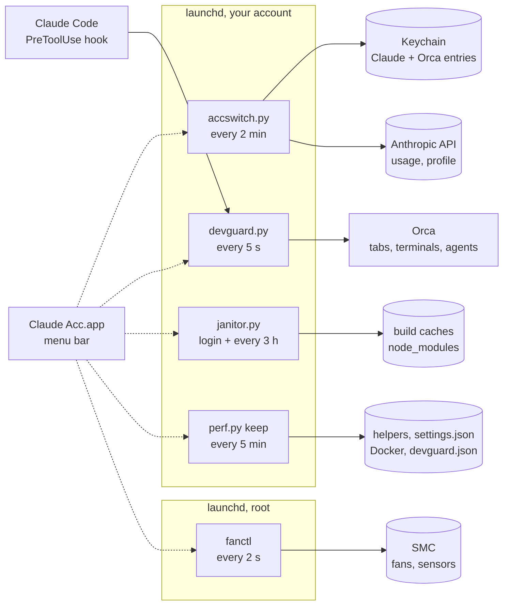

<div align="center">


# claude-acc

**A menu bar control room for a Mac that runs Claude Code agents all day.**

It rotates your Claude subscriptions before one hits the wall, keeps the agents' dev servers from eating your RAM, cleans up what they leave on disk, holds the Mac awake on a hotspot, and spins the fans up before the chip cooks.

[Install](#install) · [What it does](#what-it-does) · [How it works](#how-it-works) · [Numbers](#numbers) · [Command line](#command-line)

   

</div>

## Install

```sh
brew install outof-place/tap/claude-acc
claude-acc-setup          # scripts, launchd jobs and the menu bar app, into your account
claude-acc fans install   # optional: fan control, a small root helper (asks for Touch ID)
```

Or from source:

```sh
git clone https://github.com/outof-place/claude-acc.git
cd claude-acc
./install.sh              # builds the app and fanctl, then runs setup.sh
./install-fans.sh         # optional, root
```

Setup copies the scripts to `~/.local/share/claude-acc`, adds a `claude-acc` command to `~/.local/bin`, loads three launchd jobs (the account watcher, the janitor and the dev server guard) and opens `~/Applications/Claude Acc.app`, which adds itself to your login items on first run. To stop agents from starting a second dev server of the same app, add the [Claude Code hook](#dev-server-guard).

After `brew upgrade claude-acc`, run `claude-acc-setup` again to put the new version in place. `claude-acc uninstall` removes the launchd jobs, the app and the command and keeps your settings in `~/.local/share/claude-acc`; `claude-acc fans uninstall` gives the fans back to macOS first.

## What it does

| | |
| --- | --- |
| **Claude accounts** | Session and weekly usage of every subscription in the menu bar. Moves your running Claude Code sessions to the account with the most headroom once the active one is down to 5% of the session or 3% of the week, with no restart and no `/login`, skipping accounts whose subscription was canceled. Keeps [`depot claude`](#depot-sandboxes) sandboxes on another account than the laptop. Click any account for its plan, subscription start, renewal and both resets to the minute. |
| **Dev server guard** | Agents in [Orca](https://github.com/stablyai/orca) each run their own `next dev` with a preview tab, and Turbopack grows to 6-9 GB per server under their edits. The guard watches every dev server's real memory (the number macOS kills by), knows who is looking at it, restarts a bloated one in its own Orca terminal in seconds, stops duplicates, orphans and loops, and turns away an agent about to start a second server of the same app. |
| **Janitor** | Removes what a build or an install brings back (`.next`, `.turbo`, stale `node_modules`, Go and npm caches, Docker leftovers) when nobody is using it, at login and every 3 hours, and keeps folders that agents fill without end under a size cap. |
| **Stay Awake** | Like Amphetamine: awake until you say so or for 1-8 hours, optionally with the display on. Turns on by itself on any hotspot (iPhone over Wi-Fi or USB, Android, cellular) and keeps the hotspot from dozing off. |
| **Load & heat** | CPU load split into performance and efficiency cores, GPU load, and P-core, E-core, GPU, SSD and battery temperatures with a 20-minute chart. Fans on Auto, 50%, 75% or Max, going full speed whenever a chip passes 95 °C, and never fighting another fan app. |
| **Ultra** | One switch that tunes the Mac for agent work. Helpers no agent waits on move to the efficiency cores, memory hooks stop holding up every tool call, Node starts warm for everything sessions spawn, and the guard frees dev server memory sooner. Each change is measured before and after, and Off puts back exactly what was there. |


The UI is in English; the scripts' messages and the code comments are in Polish.

## How it works



- Every piece runs without the app. Each job writes its state to `~/.local/share/claude-acc`, and the app (dotted lines) only reads those files, calls the scripts and writes the fan mode. CPU and GPU load it reads from the kernel itself. Close it and the switching, cleanup, guard and fans keep working.
- The scripts are standard library only and still run on Python 3.9. Setup links uv's CPython 3.14 as `~/.local/share/claude-acc/python` when [uv](https://docs.astral.sh/uv/) is installed (it starts in 26 ms where the command line tools' 3.9 takes 37), the system `/usr/bin/python3` otherwise. Everything starts its script through `acc.py`, which runs it from cached bytecode: Python compiles the file it is given on every start, which was a third of a short run. Kernel numbers come through `ctypes`: `proc_pid_rusage` for memory, `sysctl` for swap and pressure, `KERN_PROCARGS2` for exact command lines.
- The app is Swift 6 with main-actor default isolation (SE-0466) and `@concurrent` for process work, Swift Charts for the charts, and SF Rounded throughout. It stays near idle with the panel open (1-2% CPU, from 40%): a state file that didn't change costs one `stat` and wakes no view, live readings (load, heat, fans, memory, build progress) change in place, since while any animation runs SwiftUI updates the whole panel on every frame, and the spinning fan is a Core Animation layer the render server turns.
- `fanctl` talks to the SMC through IOKit's `AppleSMC` user client. Reading needs no root; the daemon that writes runs as root, reads only a mode from your folder, and writes its readings back atomically.

### Accounts under the hood

A Claude Code account is the `claudeAiOauth` object inside a Keychain entry. Claude Code reads `Claude Code-credentials`, plus `Claude Code-credentials-<first 8 hex chars of sha256(config dir)>` when `CLAUDE_CONFIG_DIR` is set. [Orca](https://github.com/stablyai/orca) keeps a copy of every account you add to it under `Orca Claude Code Managed Credentials`. Switching accounts means copying one account's `claudeAiOauth` into the entries the live sessions read.

- `accswitch.py` holds all the logic. launchd runs `accswitch.py tick` every 2 minutes, with or without the app.
- Usage comes from `GET https://api.anthropic.com/api/oauth/usage`, and the account behind a token from `/api/oauth/profile`.

## Numbers

Measured on a MacBook Pro 16" M4 Max with 48 GB, on 2026-10-04, with several agents working in Orca.


A Turbopack dev server grows fivefold under an agent's edits, and `turbopackMemoryEviction: "full"` changes nothing: 6.01 GB against 5.97 GB after 30 edits. Next.js restarts a dev server only when its V8 heap fills, and Turbopack's memory lives outside it. What does work is a restart: the server comes back from its disk cache in seconds at a third of the size, which is what the guard does once a server passes 5 GB and goes quiet.


With agents compiling, macOS on Auto kept the fans at about 2,000 rpm and let the hottest CPU sensor reach **115&nbsp;°C**. The fixed settings, as the SMC reports them on the same Mac:

| Setting | Fan speed |
| --- | --- |
| macOS Auto, idle | ~1,400 rpm |
| 50% | ~3,560 rpm |
| 75% | ~4,670 rpm |
| Max | 5,777 rpm |

On any fixed setting the daemon goes to full speed when a sensor passes 95 °C and comes back below 85 °C.

Ultra, measured on the same Mac with Orca and nine Claude Code sessions running:

| Tweak | Before | After |
| --- | --- | --- |
| A memory helper that scanned its 1.9 GB database all day, moved to the efficiency cores | 32% of a P-core, ~1 W | 0.1%, ~0.1 W |
| Node compile cache for what sessions spawn: `require('typescript')` | 96 ms | 49 ms |
| `git status` in an agent worktree repo, with `untrackedCache` and `fsmonitor` (opt-in) | 71 ms | 26 ms |
| Hook wait on every agent tool call, with a synchronous memory hook made async | 53 ms p50, 73 ms p90 | 24 ms p50, 30 ms p90 |

## How it avoids logging you out

Each of these rules comes from an account that actually lost its login while the tool was being built:

- Refreshing a token rotates it, and presenting a refresh token that was already used got the whole account logged out. Claude Code sessions refresh the active account on their own, about 5 minutes before the token expires, so the watcher never refreshes the active account while a session could. It copies the pair the session wrote instead, from whichever Keychain entry the sessions use (`Claude Code-credentials` without `CLAUDE_CONFIG_DIR`, the hashed one with it). It refreshes the active account itself only once the token has been expired for 15 minutes, when no session is running.
- An inactive account whose token no session holds is refreshed by whichever process reads it first (the watcher, a click, or the panel), one process at a time behind a file lock. The panel never refreshes a token that a session in any config directory may hold.
- It never writes a token it hasn't checked against the API first. A future expiry date doesn't prove the token still works.
- It replaces only `claudeAiOauth`. The same Keychain entry holds `mcpOAuth`, the tokens of your MCP servers, which belong to the config directory and survive every switch.
- A 429 from the usage endpoint means "unknown", never "dead". It backs off for 2 minutes, then 4, 8 and 15 while the endpoint keeps refusing, starts over after the first good answer, and doesn't refresh or flag anything in the meantime. Claude Code and Orca poll the same endpoint too, so it can throttle even while this tool is quiet. Whether a token works is checked against the profile endpoint, so switching still works while the usage endpoint is throttled. Accounts with a canceled subscription get a 403 there, so they aren't asked at all.
- Before overwriting the live entry it copies the token there back to its Orca copy, because the running session may have rotated it since the last switch.

## Requirements

- macOS 26 or newer on Apple silicon, with Swift 6.2 or newer (Xcode or the command line tools) to build the app. Homebrew builds it for you.
- `/usr/bin/python3` (ships with the command line tools). With [uv](https://docs.astral.sh/uv/) installed, setup uses its CPython 3.14 instead.
- Claude Code. Tested with 2.1.284.
- Orca with your Claude accounts added as managed accounts, and **System default** selected as the active Claude account in Orca. With a managed account selected, Orca puts its own account back whenever a terminal starts and every 15 minutes, undoing every switch, and it refreshes that account's token itself. claude-acc reads Orca's settings, and while an account is selected there the watcher stands down, switching is blocked and the panel tells you to pick System default.

## Command line

| Command | What it does |
| --- | --- |
| `claude-acc status` | Usage of every account and the switching order |
| `claude-acc who` | The active account, its burn rate and when it will hit the wall |
| `claude-acc switch <email>` | Switch to that account |
| `claude-acc switch --auto` | Switch to the next account in line |
| `claude-acc login <email>` | Log the account in again in the browser |
| `claude-acc heal [--deep]` | Recover accounts whose Orca copy died after a rotation elsewhere |
| `claude-acc tick` | One watcher pass (what launchd runs) |
| `claude-acc depot [--force]` | Which account the Depot sandboxes run on; `--force` sends its token again |
| `claude-acc depot --fallback` | Store a long-lived `claude setup-token` token for when no account has headroom |
| `claude-acc clean [--dry-run]` | Clean up now: every janitor task, whatever its schedule |
| `claude-acc mac status` | Free space, the last cleanup and warnings |
| `claude-acc mac report` | What slows the Mac down: top processes, Spotlight, orphaned dev servers, data of uninstalled apps, broken launchd entries |
| `claude-acc mac spotlight` | Projects whose `node_modules` Spotlight indexes, and the settings pane to exclude them |
| `claude-acc mac optimize [--dry-run\|--undo]` | Faster Dock, window and Finder animations, and disabling launch agents whose app is gone. Reversible |
| `claude-acc guard status [--json]` | Dev servers, their memory, who watches them and what the guard is about to do |
| `claude-acc guard once [--dry-run]` | One guard pass, at most one action |
| `claude-acc guard stop <pid\|:port>` | Stop a dev server the way the guard does |
| `claude-acc guard recycle <pid\|:port>` | Restart a dev server in its own Orca terminal |
| `claude-acc guard pin <:port\|dir> [--for 12h \| --forever] [--reason TEXT] [--no-restart]` | An exception for a while: the guard never stops that server |
| `claude-acc guard unpin <:port\|dir\|all>` / `claude-acc guard pins` | Drop a pin / list pins with their reasons and expiry |
| `claude-acc fans [read\|keys]` | Fan speeds, CPU and GPU temperature, or every SMC key |
| `claude-acc fans set auto\|<30-100>` | Set the fans by hand (root) |
| `claude-acc fans install\|uninstall` | Install the fan daemon, or remove it and give the fans back to macOS |
| `claude-acc perf ultra on\|off\|status` | Turn Ultra on or off, or show what it changed and the numbers |
| `claude-acc perf bench network\|cpu\|gpu\|fs` | Measure: queueing in the network vs inside the connection, P-core share and wake-up latency, GPU time per app, the file cache |
| `claude-acc perf list` / `apply` / `undo <name>` | Every tweak on its own, with what it changes and how it was measured |
| `claude-acc perf-root vnodes trial [--keep]` | Root: a bigger vnode cache, measured before and after; `vnodes apply --persist` keeps it across reboots |
| `claude-acc perf-root spotlight apps-only\|undo` | Root: Spotlight indexes apps only; undo restores the previous privacy list |
| `claude-acc perf-root devtools add\|undo\|status` | Opens Developer Tools in System Settings and waits until Orca is on the list, so fresh Go test binaries skip Gatekeeper |
| `claude-acc perf bench gatekeeper` | How long the first run of a freshly built binary waits for Gatekeeper from this terminal |
| `claude-acc uninstall` | Remove the launchd jobs, the app and this command; settings stay |

## Configuration

`~/.local/share/claude-acc/config.json`. Every key is optional.

| Key | Default | Meaning |
| --- | --- | --- |
| `hard_session_left` | `5` | Switch when the active account has this % of the 5-hour window left |
| `hard_weekly_left` | `3` | Switch when it has this % of the week left |
| `min_session_left` / `min_weekly_left` | `15` / `8` | An account needs at least this much to be switched to |
| `last_resort` | `[]` | Emails used only when nothing else has headroom |
| `never` | `[]` | Emails never switched to |
| `config_dir` | `~/.claude` | The config directory whose sessions get switched |
| `other_config_dirs` | `[]` | Other config directories whose entries get the new token when an account refreshes, but are never switched |
| `depot_sync` | `true` | Keep the `CLAUDE_CODE_OAUTH_TOKEN` secret of `depot claude` sandboxes on an account with headroom |
| `depot_min_valid_hours` | `4` | A token sent to Depot must stay valid at least this long; a shorter one is refreshed first |
| `depot_bin` | `""` | Path of the Depot CLI; empty means `PATH`, then Homebrew |

## Depot sandboxes

[`depot claude`](https://depot.dev/docs/agents/claude-code/quickstart) starts Claude Code in a remote sandbox with the token stored in the organization secret `CLAUDE_CODE_OAUTH_TOKEN`. Every tick keeps that secret on the account first in the switching order **other than the local one**, so the laptop and the sandboxes never burn the same account. The token is sent again only when that account runs out of headroom, becomes the local account, or has less than `depot_min_valid_hours` of validity left; an idle account's token is refreshed before it is sent, the active account's never (its sessions own that refresh). With no other account left, the long-lived token from `claude-acc depot --fallback` goes out instead. A Depot failure is logged and never stops the switching. Requires the Depot CLI logged in to the organization (`depot login`).

## Mac janitor

Agents build, install and test all day, and every run leaves something on disk: `.next` caches of a few GB per worktree, `node_modules` of projects nobody touched in a month, `go-build` temp dirs from interrupted test runs, npx and uv caches. `janitor.py` removes what a build or an install brings back, and only what nobody is using.

launchd runs `janitor.py sweep` at login and every 3 hours as a background process: macOS keeps it on the efficiency cores and throttles its disk access, so a cleanup never competes with your work. Right after boot it waits until the system has been up for 5 minutes, and on battery below 30% it waits for the charger.

Before removing anything it checks, with one `lsof` over your processes, that no process has a file open in it and that no program has its working directory there. A terminal sitting at a prompt in the project doesn't count, a dev server does. The directory is renamed first and deleted after, so a dev server starting at that moment builds from scratch instead of reading half-deleted chunks. An interrupted delete is finished on the next run.

| Task | What goes | When |
| --- | --- | --- |
| `next` | `.next` and `.next-*` next to a `package.json`, unchanged for 24 hours | every run |
| `caches` | `.turbo`, `node_modules/.cache`, `node_modules/.vite`, unchanged for 7 days | daily |
| `node_modules` | every `node_modules` of a project where no file changed and git didn't move for 30 days | daily |
| `tmp` | `go-build*` in `$TMPDIR` older than 6 hours | every run |
| `caps` | the oldest entries of folders listed in `caps` once a folder is over its limit (the guard also runs it every 10 minutes) | every run |
| `go` | the least recently used entries of the Go build cache once it's over 20 GB, down to 12 GB, so agents keep their warm builds (Go trims entries unused for 5 days on its own) | daily |
| `npm` | `npm cache verify`, npx packages unused for 30 days (not the ones a running process uses, like MCP servers), npm logs older than a week | daily |
| `pnpm` | `pnpm store prune`, and after every run that removed a `node_modules` | weekly |
| `docker` | dangling images and build cache older than a week, only when the engine is already running | daily |
| `xcode` | DerivedData unchanged for 14 days, unavailable simulators | daily |
| `brew` | `brew cleanup --prune=14` | weekly |
| `uv` | `uv cache prune` | weekly |
| `logs` | files in `~/Library/Logs` older than 30 days | daily |

Each run also checks which projects' `node_modules` end up in the Spotlight index. Spotlight skips directories whose name starts with a dot or ends with `.noindex`, so pnpm's `.pnpm` store is never indexed, but hoisted `node_modules` (Expo, npm, yarn) are, and every install makes Spotlight chew through tens of thousands of files. Neither a `.metadata_never_index` file nor `chflags hidden` stops it on current macOS. The fix is System Settings > Spotlight > Search Privacy; `claude-acc mac spotlight` lists the projects and opens that pane.

`janitor-root.sh` does what needs root, run it by hand with `sudo`: it parks system launchd entries whose app is gone in `/Library/launchd-disabled-<date>` and removes crash reports older than a month. With `--high-power` it also switches a Mac that supports it to High Power mode on the charger (battery stays on automatic). `--dry-run` shows what it would do. The iOS simulator dyld cache in `/Library/Developer/CoreSimulator/Caches` is protected by SIP even from root, so it stays.

Configuration lives in `~/.local/share/claude-acc/janitor.json`. Every key is optional.

| Key | Default | Meaning |
| --- | --- | --- |
| `roots` | `~/Documents`, `~/Developer`, `~/Projects`, `~/code`, `~/src` | Where projects live |
| `protect` | `[]` | Paths the janitor never touches (footage, experiment results) |
| `next_idle_hours` | `24` | Age of a `.next` cache before it goes |
| `cache_idle_days` | `7` | Age of `.turbo` and `node_modules/.cache` |
| `node_modules_idle_days` | `30` | Project inactivity before its `node_modules` goes, `0` turns it off |
| `npx_idle_days` | `30` | Age of an npx package |
| `go_cache_max_gb` / `go_cache_keep_percent` | `20` / `60` | Go build cache size that triggers a trim, and how much of it the trim keeps (the most recently used entries) |
| `derived_data_idle_days` | `14` | Age of Xcode DerivedData |
| `log_days` | `30` | Age of logs in `~/Library/Logs` |
| `min_battery_percent` | `30` | On battery below this, the run waits for the charger |
| `notify_min_gb` | `2` | A run that frees at least this much sends a notification |
| `low_disk_gb` | `40` | Below this much free space, a warning (at most every 12 hours) |
| `skip` | `[]` | Task names to leave out, like `["docker", "brew"]` |
| `caps` | `[]` | Folders agents fill without end, like `[{"path": "~/.cache/portivo-perf/*/builds", "max_gb": 10, "keep": 1}]`. Entries over `max_gb` go oldest first (by creation date, since `rsync -a` copies mtimes); the `keep` newest always stay, and so does anything changed in the last `fresh_minutes` (10) |

## Dev server guard

With a few worktrees open in Orca, every agent starts its own `next dev` and opens a preview tab. Measured on a 48 GB Mac on 2026-10-04:

- a Turbopack dev server holds its module graph in native Rust memory and reaches 7-8 GB of footprint after an hour of agent edits. A restarted one was back from 2.3 to 7.8 GB within 10 minutes. Next.js has its own restart watchdog, but it only watches the V8 heap, and Turbopack's `turbopackMemoryEviction: 'auto'` waits for memory pressure feedback from the OS;
- the OS never gives it. With 12.7 of 13.3 GB of swap used, `kern.memorystatus_vm_pressure_level` still said normal, right until jetsam started killing processes with reason `low-swap`;
- an open preview keeps an HMR websocket, so every file an agent saves is a recompile and a page reload: one `tokens.css` edit cost the server with a preview 10 s of CPU, the six servers without one 0.1 s.

`devguard.py` runs from launchd all the time (`KeepAlive`, standard priority, so it gets the CPU exactly when the Mac is choking) and looks every 5 seconds without starting a single process: the process table from `sysctl` (`KERN_PROC_ALL`, `KERN_PROCARGS2`), sockets from `proc_pidfdinfo`, and Orca over its own unix socket. A pass used to spawn `ps`, `lsof` and four `orca` CLI calls, 3.9 s of CPU a minute in child processes; now it takes about 0.2 s. It reads:

- memory the way jetsam counts it: `phys_footprint` from `proc_pid_rusage`, plus CPU time and disk writes, read through `ctypes` without forking anything per process;
- who watches each server: TCP clients of its ports (an Orca tab, a browser, a headless Chrome), Orca's preview tabs, and whether the tab is the one you are looking at (active tab of the worktree selected in Orca);
- memory pressure from swap growth and the compressor's `vm.compressor.compactor.swapouts_queued_pressure` counter. Swap that stays full after memory was freed is only a warning; full and still growing is critical;
- Orca's worktrees, agents and terminals, so it knows which terminal a server runs in and whether an agent is working there. Reads go over Orca's runtime socket with the request its CLI sends, and fall back to the `orca` CLI when that fails; actions (restarting a server in its terminal) always use the CLI. It never starts Orca.

What it does, gentlest first:

| Action | When |
| --- | --- |
| background QoS (`PRIO_DARWIN_BG`, efficiency cores and throttled disk) | a server you are not looking at; back to normal priority once you switch to its preview |
| restart in its own Orca terminal | the server is over `max_server_gb` and has been quiet for `quiet_seconds`. Turbopack comes back from its disk cache in seconds and the preview reconnects by itself. The exact argv comes from `KERN_PROCARGS2` and goes back in with `orca terminal send`, only into a plain shell that is back at its prompt |
| stop | a second server of the same app nobody watches, a server whose agent or terminal is gone, a server nobody watched or used for `idle_minutes` (twice that while an agent works in its worktree), and a server restarted `max_recycles_per_hour` times within an hour, which is the HMR loop again |
| free the biggest | dev servers over `budget_percent` of RAM, or memory pressure. With a warning only servers without a preview or bloated ones; when critical, also ones agents watch. The server you watch is never stopped, at most restarted |

One action at a time, then `cooldown_seconds` to let memory settle, and the swap growth window starts over so an old trend can't trigger the next one. A server younger than `grace_minutes` is left alone. After a stop the guard closes the server's background preview tabs in Orca (they would only keep reloading), writes a `devguard: ...` comment on the worktree card when the card has no comment of someone else's, sends a notification, and logs the command to bring the server back.

### Pins: exceptions for a while

Some servers have to stay up even when nobody watches them: a server a film pipeline captures from every few minutes, a demo you are about to show. `protect` in the config is permanent; a pin is the same promise for a while, set from the terminal (by you or by an agent) without editing JSON:

```sh
claude-acc guard pin :3747 --for 24h --reason "hero film captures"
claude-acc guard pin ~/code/site/apps/web          # a directory: every server in or below it
claude-acc guard pins
claude-acc guard unpin :3747
```

A pinned server is never stopped: not as idle, a duplicate, an orphan, over budget or under pressure. When it bloats over `max_server_gb` it is still restarted in its terminal (it is back in seconds), and a restart loop only warns. `--no-restart` holds even that, until memory is critical: then the biggest pinned server is restarted, never stopped, and only when nothing unpinned is left to free. Pins last 12 hours unless you say `--for 90m`, `--for 2d` or `--forever`, live in `~/.local/share/claude-acc/devguard-pins.json`, take effect on the next pass without restarting the guard, and show up in `guard status` with their reason and expiry. Expired ones are ignored.

`claude-acc-hook` is a `PreToolUse` hook for Claude Code. When an agent is about to start a dev server (also through `orca terminal create --command`, `cd`, `pnpm -C`, `--filter`), it refuses a second server of an app that already runs and gives the agent its URL instead, and refuses a new one when memory is critical or the servers are over budget. It denies even under `--dangerously-skip-permissions`. `DEVGUARD_ALLOW=1` in front of the command lets it through. Add it to `~/.claude/settings.json`:

```json
{ "hooks": { "PreToolUse": [ { "matcher": "Bash", "hooks": [
  { "type": "command", "command": "$HOME/.local/share/claude-acc/claude-acc-hook", "timeout": 10 }
] } ] } }
```

The hook runs before every Bash command of every agent, and most commands neither start a dev server nor run Go. `claude-acc-hook` is a small native binary that answers those in about 5 ms; a command with one of the words that matter (`devguard.py words`, written to `hook-words.json` at setup) goes on to `devguard.py admit` with the same input, which decides everything. Before, Python started for every command: 44 ms each, and hundreds when the Mac is loaded. `python3 devguard.py admit` still works as the hook on its own.

Configuration lives in `~/.local/share/claude-acc/devguard.json`. Every key is optional.

| Key | Default | Meaning |
| --- | --- | --- |
| `mode` | `enforce` | `observe` only reports and logs |
| `budget_percent` | `35` | All dev servers together, as % of RAM |
| `max_server_gb` | `5` | A single server above this is bloated |
| `swap_warn_percent` / `swap_critical_percent` | `12` / `20` | Swap as % of RAM for a warning and, while it grows, for critical |
| `available_critical_percent` | `10` | `kern.memorystatus_level` at or below this is critical |
| `kernel_pressure` | `true` | Take the kernel's pressure level (`kern.memorystatus_vm_pressure_level`) into account; `false` relies on swap and `memorystatus_level` alone |
| `quiet_seconds` | `30` | No CPU and no terminal output for this long before a watched server is restarted (10 times that for the one you watch) |
| `grace_minutes` | `3` | A new server is left alone this long |
| `duplicate_minutes` / `orphan_minutes` / `idle_minutes` | `5` / `10` / `45` | When a duplicate, an orphan and an idle server go |
| `cooldown_seconds` | `45` | Pause after every action |
| `max_recycles_per_hour` | `2` | More restarts of one app than this is a loop: stop instead |
| `background_unattended` | `true` | Background QoS for servers you don't watch |
| `close_tabs` / `orca_comment` / `notify` | `true` | What happens around a stop |
| `protect` | `[]` | Server paths (or anything above them) and ports like `":3000"` the guard never touches; for a while, use `guard pin` |
| `scope` | `[]` | When set, the guard only sees servers under these paths |
| `runtimes` | `node`, `bun`, `deno` | Interpreters dev servers run under |
| `caps_minutes` | `10` | How often the guard applies the janitor's `caps`, `0` turns it off |

## Stay Awake

The **Stay Awake** card holds an `IOPMAssertion`, the same thing `caffeinate` does: the Mac doesn't sleep while it's on, and with **Keep the display on** neither does the screen. It runs until you turn it off or for 1, 2, 4 or 8 hours. Closing the lid still sleeps a MacBook unless an external display is connected.

With **Auto on any hotspot** it switches itself on whenever the Mac joins a network that macOS marks as expensive: an iPhone or Android hotspot over Wi-Fi or USB, or a cellular modem. It turns off again when you leave that network, unless you turned it on yourself. **Keep the hotspot alive** sends one small request every 25 seconds, so a phone doesn't drop a hotspot it thinks nobody uses. The settings live in the app's preferences.

## Load & heat

`fanctl` reads the SMC: every fan's speed, minimum, maximum and target, and the temperature sensors grouped by what they measure: P-cores (`Tp*`), E-cores (`Te*`), GPU (`Tg*`), SSD (`TH*`) and battery (`TB*`). The panel shows the hottest of each group, the fan speeds and a 20-minute chart of CPU and GPU temperature. Reading needs no root, so the card works without the daemon.

Above that sits the load, the way Activity Monitor counts it: CPU from the kernel's per-core tick counters (`host_processor_info`), split into performance and efficiency cores (Apple silicon numbers the efficiency cores first), and GPU from the `Device Utilization %` the GPU driver publishes in the I/O Registry. The app reads both every 3 seconds while the panel is open and once a minute otherwise, with nothing spawned and no root.

Setting the fans needs root, so `claude-acc fans install` puts `fanctl` in `/usr/local/libexec` (owned by root) and loads it as a LaunchDaemon. Every 2 seconds it follows the mode the panel writes to `~/.local/share/claude-acc/fans.json`:

- `{"mode": "auto"}` gives the fans back to macOS, `{"mode": "fixed", "percent": 50}` holds them at that share of the range between their minimum and maximum. Until you pick a mode, the daemon only reads.
- Above 95 °C on any CPU or GPU sensor it goes to full speed, and back to your setting below 85 °C.
- Another fan app (Mole, Macs Fan Control, TG Pro) wins: when the fans move to a speed the daemon didn't set, the panel says so and the daemon leaves them alone. It only takes the fans back after sleep, when macOS reset them to auto under a fixed setting.
- When the daemon stops, it gives the fans back to macOS, unless another app had them.

## Ultra

A Mac running a dozen agents spends a surprising amount of its time on work nobody waits for. `perf.py` measured where it went on an M4 Max with Orca and nine Claude Code sessions, and Ultra turns on the fixes that paid off. Every tweak records what was there before, measures before and after, and `ultra off` restores it byte for byte, leaving alone anything you changed by hand in the meantime. Running `ultra on` twice is safe. launchd runs `perf.py keep` every 5 minutes, which reapplies tweaks to processes that restarted with a new pid and fills in numbers that arrive later.

| Tweak | What it changes |
| --- | --- |
| `bg-helpers` | Background QoS (`PRIO_DARWIN_BG`: efficiency cores, throttled disk) for always-on helpers matched by `background` in `perf.json` |
| `claude-hooks-async` | `"async": true` on the hooks listed in `async_hooks`, in `~/.claude/settings.json`. Every tool call of every session waited for them |
| `node-compile-cache` | `NODE_COMPILE_CACHE` in the `env` of `~/.claude/settings.json`, so tsc, eslint, MCP servers and hooks start from a warm V8 cache. The `claude` binary itself runs on Bun and doesn't need it |
| `devguard-budget`, `devguard-max-server` | The guard's `budget_percent` from 35 to 25 and `max_server_gb` from 5 to 4 |
| `git-speed` | `core.untrackedCache` and `core.fsmonitor` in the repos listed in `git_repos` (empty by default) |

Docker's VM is left out of Ultra because the cap applies only after a Docker restart: `claude-acc perf apply docker-vm` writes `MemoryMiB` 6144 while Docker is closed (the VM held 8 GB for 3.7 GB of containers), and every container with a restart policy comes back on its own.

Two root tweaks sit next to Ultra in the panel, each with the command to copy:

- **A bigger vnode cache.** The kernel's file cache held 263,168 vnodes and recycled 28 million in 5 hours, so the metadata of a large `node_modules` (358,000 entries in a pnpm store) never stayed cached. `claude-acc perf-root vnodes trial` measures a second `lstat` pass before and after raising `kern.maxvnodes` to 786,432: 3.59 s to 2.51 s here, with 253,000 vnodes recycled per pass dropping to 4,500. `vnodes apply --persist` keeps it across reboots with a small LaunchDaemon. It costs about 1.2 KB of wired kernel memory per vnode, 0.63 GB in all, and it helps only metadata (`lstat`, `open`, lookups): file contents still leave the cache under memory pressure. The kernel never frees vnodes, so an undo stops the growth but gives the memory back only at the next reboot.
- **Spotlight for apps only.** `claude-acc perf-root spotlight apps-only` puts every home folder except `Applications`, plus `/Library`, `/opt`, `/usr/local` and `/Users/Shared`, on Spotlight's privacy list and rebuilds the index, so Spotlight stops chewing through package stores (half a million files under `~/Library/pnpm` and `~/go` here) and keeps finding apps. System Settings has no command line for that list and `mds` keeps it in memory, so the script writes `VolumeConfiguration.plist`, kills `mds` before it can write its old copy back, and lets launchd start it on the new list. `undo` restores the list you had.

What was measured and left alone, in [`docs/perf-research.md`](docs/perf-research.md) (Polish): open-file and process limits (5% used), App Nap for Orca (it never naps), forced L4S (halved the upload here), an upload shaper (the router adds only 1-4 ms under load), MCP servers duplicated per session (2.3 GB across nine sessions, with no shared mode to switch to), and the Claude API connections (already reused).

## Tests

```sh
/usr/bin/python3 -m unittest discover -s tests
```

The tests run the real script end to end against fake `security`, `curl` and `claude` binaries put first on `PATH`, so they never touch your Keychain or your accounts. They cover logging in, switching during a 429, keeping MCP tokens, cancelling a login halfway, and leaving an account whose token died.

The janitor tests run the real script on a temporary `$HOME` with the real `lsof`: caches that go, caches kept because a file is open or a dev server works in the app, a shell prompt that doesn't block, protected paths, stale and active projects, an interrupted delete, and `caps` dropping the oldest snapshots.

The performance tests run `perf.py` on a temporary `$HOME`: every tweak applies, records and undoes exactly, Ultra on and off restore `settings.json` and `devguard.json` byte for byte, a second `ultra on` changes nothing, and a value someone changed after Ultra survives `ultra off`.

The guard tests check its decisions on a made-up picture of the Mac (bloated, busy, duplicate, orphaned, watched and loop-restarted servers, warning and critical pressure, sticky and growing swap) and the hook's reading of agent commands. Then they start a fake `next dev` (Python with 48 MB of ballast, listening on a port) on a temporary `$HOME`, with `scope` limited to it so the real dev servers on the Mac stay invisible, and check that the guard sees its port and size, stops it, leaves it alone in `--dry-run` and `observe`, and that the hook sends a second start to the running one.

To see the panel without clicking the menu bar, render it to a PNG, from live data or from a JSON file:

```sh
"$HOME/Applications/Claude Acc.app/Contents/MacOS/ClaudeAcc" --render panel.png --snapshot docs/demo-snapshot.json
```

With `--snapshot` the clock stops at the moment the snapshot was taken, and `demo-guard.json`, `demo-janitor.json` and `demo-fans.json` next to it stand in for the guard, cleanup and fan state. `--open <account id>` renders that account opened. Lists that scroll in the panel come out in full.

## Caveats

- It relies on undocumented endpoints and on Claude Code's own OAuth client, so any Claude Code update can break it.
- This project is not affiliated with Anthropic. Section 3.7 of Anthropic's [Consumer Terms](https://www.anthropic.com/legal/consumer-terms) prohibits accessing the services "through automated or non-human means, whether through a bot, script, or otherwise" outside the API, and this tool polls those endpoints from a script. Read the terms and decide for yourself.
- The renewal date is the monthly anniversary of the subscription start. The API doesn't expose the billing date, so it's wrong for yearly plans.

## License

MIT
